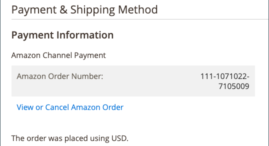

# 常见Amazon订单处理任务

[Commerce订单处理](https://experienceleague.adobe.com/docs/commerce-admin/stores-sales/order-management/orders/order-processing.html#process-an-order)可以管理您的Amazon订单，包括向买方发送电子邮件、履行订单（发货）、发放退款/退款、添加注释等。 要管理Amazon订单，必须将&#x200B;[**导入Amazon订单**](./order-settings.md)&#x200B;设置设置为`Enabled`，以便在收到Amazon订单时创建相应的[!DNL Commerce]订单。 Amazon订单信息显示在商店仪表板的&#x200B;*[!UICONTROL Recent Orders]*&#x200B;部分中。

启用后，将为Amazon订单创建相应的[!DNL Commerce]订单，并且Amazon订单编号显示在&#x200B;_[!UICONTROL Order Number]_列中。 如果创建了相应的[!DNL Commerce]订单，请单击订单编号以在[Commerce订单处理](https://experienceleague.adobe.com/docs/commerce-admin/stores-sales/order-management/orders/order-processing.html#process-an-order)页面中打开该订单。 您可以像处理其他[[!DNL Commerce] 订单一样管理订单](https://experienceleague.adobe.com/docs/commerce-admin/stores-sales/order-management/orders/order-processing.html#process-an-order)。

[!DNL Commerce]订单编号不显示&#x200B;_[!UICONTROL Recent Orders]_信息。 仅当您单击商店仪表板上的订单编号并在[Commerce订单处理](https://experienceleague.adobe.com/docs/commerce-admin/stores-sales/order-management/orders/order-processing.html#process-an-order)中打开该订单时，才会显示Commerce订单编号。 查看[!DNL Commerce]订单时，Amazon订单编号将显示在&#x200B;*[!UICONTROL Payment & Shipping Method]*部分中。 它还包含&#x200B;*[!UICONTROL View or Cancel Amazon Order]*和&#x200B;*[!UICONTROL View all Amazon Orders]*的选项，具体取决于订单配送状态。

请参阅[取消未发运的订单](./cancel-unshipped-order.md)。

{width="500"}

在处理Amazon订单时，Amazon销售渠道会更新订单信息，并将其与您的[!DNL Amazon Seller Central]帐户同步。 您的cron设置决定了订单信息在Amazon和Amazon Sales Channel之间同步的频率。

常见Commerce [订单处理](https://experienceleague.adobe.com/docs/commerce-admin/stores-sales/order-management/orders/order-processing.html#process-an-order)任务包括：

- [排序操作](https://experienceleague.adobe.com/docs/commerce-admin/stores-sales/order-management/orders/orders.html#actions)
- [订单搜索](https://experienceleague.adobe.com/docs/commerce-admin/stores-sales/order-management/orders/orders.html#order-search)
- [处理订单](https://experienceleague.adobe.com/docs/commerce-admin/stores-sales/order-management/orders/order-processing.html#process-an-order)
   - [查看订单](https://experienceleague.adobe.com/docs/commerce-admin/stores-sales/order-management/orders/order-processing.html#process-an-order#view-an-order)
   - [处理订单](https://experienceleague.adobe.com/docs/commerce-admin/stores-sales/order-management/orders/order-processing.html#process-an-order#process-an-order)
   - [订单和帐户信息](https://experienceleague.adobe.com/docs/commerce-admin/stores-sales/order-management/orders/order-processing.html#process-an-order#order-and-account-information)
   - [地址信息](https://experienceleague.adobe.com/docs/commerce-admin/stores-sales/order-management/orders/order-processing.html#process-an-order#address-information)
   - [付款和送货方式](https://experienceleague.adobe.com/docs/commerce-admin/stores-sales/order-management/orders/order-processing.html#process-an-order#payment--shipping-method)
   - [查看订购的项目](https://experienceleague.adobe.com/docs/commerce-admin/stores-sales/order-management/orders/order-processing.html#process-an-order#review-items-ordered)
- [发出信用/退款](https://experienceleague.adobe.com/docs/commerce-admin/stores-sales/order-management/credit-memos/credit-memo-create.html)
- [正在完成/发送订单](https://experienceleague.adobe.com/docs/commerce-admin/stores-sales/order-management/shipments.html#create-a-shipment)
- [创建发票](https://experienceleague.adobe.com/docs/commerce-admin/stores-sales/order-management/invoices.html#create-an-invoice)
- [取消未发运的订单](./cancel-unshipped-order.md)

>[!NOTE]
>
>如果订单处于`Unshipped`状态，您可以在[[!UICONTROL Amazon Order Details]](./amazon-order-details.md)页面上[取消Amazon订单](./cancel-unshipped-order.md)。 如果订单已发运，则无法取消该订单。

请参阅[Commerce Order Management](https://experienceleague.adobe.com/docs/commerce-admin/stores-sales/introduction.html#order-management-and-operations)。
