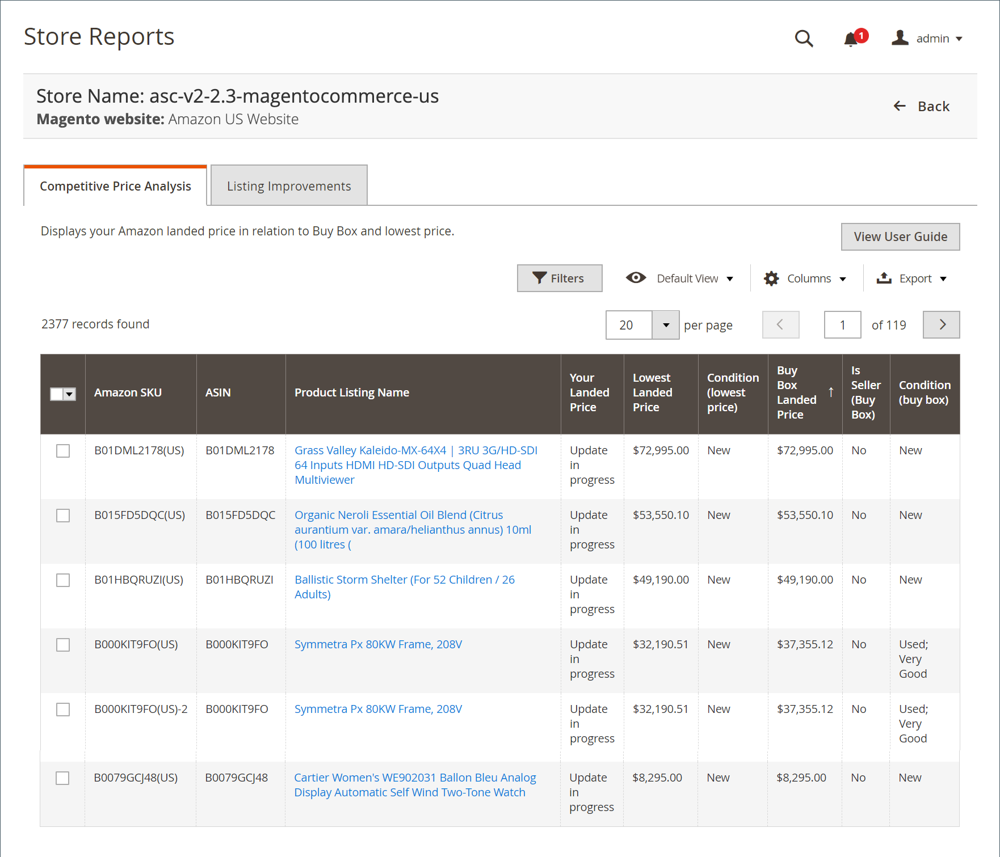

# 竞争价格分析

竞争价格分析报表显示您的每个市场的Amazon列表以及相应的 [Buy Box](./buy-box-competitor-pricing.md) 价格和 [最低竞争对手](./lowest-competitor-pricing.md) 价格值。 没有可用于日志的操作。 它是仅供审阅的功能。

## 默认列

| 列 | 描述 |
|--- |--- |
| [!UICONTROL Amazon Seller SKU] | 由Amazon分配给产品以标识产品、选项、价格和制造商的SKU（库存单位）。 |
| [!UICONTROL ASIN] | 由10个字母和/或数字组成的唯一块，用于标识项目。  ASIN表示Amazon标准标识号。 ASIN是由10个字母和/或数字组成的唯一块，用于标识项目。 对于书籍，ASIN与ISBN号相同，但对于所有其他产品，在将项目上传到其目录后，将创建一个新的ASIN。 您可以在Amazon的产品详细信息页面上找到项目ASIN，以及与项目相关的更多详细信息。 |
| [!UICONTROL Product Listing Name] | 产品的名称。 |
| [!UICONTROL Your Landed Price] | 贵公司产品的上市价格加其运费。 |
| [!UICONTROL Lowest Landed Price] | 您的Amazon竞争对手最低的地盘价格（上市价格加上其运价）。 |
| [!UICONTROL Condition (lowest price)] | 以最低价格列出的产品的状态。 |
| [!UICONTROL Buy Box Landed Price] | 本公司于2014年12月31日的 [Buy Box](./buy-box-competitor-pricing.md) 职位列表。 |
| [!UICONTROL Is Seller (Buy Box)] | 指示您是否已获得上市Buy Box职位(NA表示没有上市Buy Box价格)。 |
| 条件(Buy Box) | Buy Box位置列表的条件。 |
