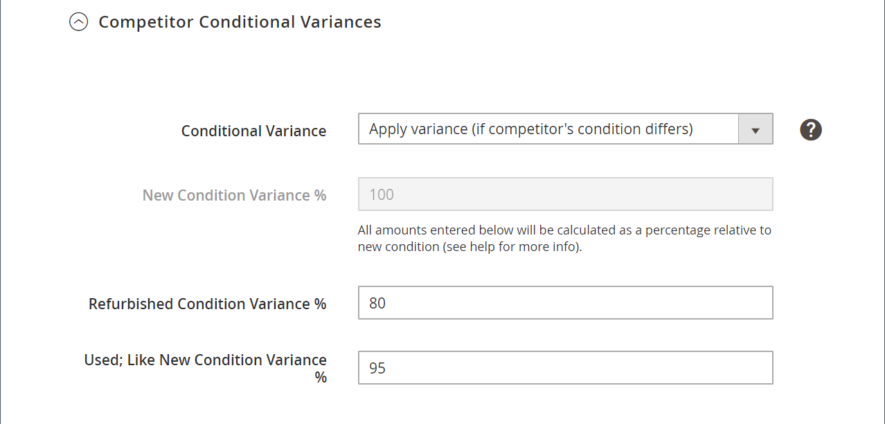

# 智能重新定价规则：竞争对手条件差异

智能重新定价规则的部分包括：

- [[!UICONTROL Select Rule Type]](./intelligent-repricing-rules.md)
- [!UICONTROL Competitor Conditional Variances]
- [[!UICONTROL Price Adjustment]](./price-adjustment.md)
- [[!UICONTROL Floor Price]](./floor-price.md)
- [[!UICONTROL Optional Ceiling Price]](./optional-ceiling-price.md)

智能的重新定价规则使用Amazon竞争对手的定价来确定您的上市价格。 竞争对手是其他销售商，与您在Amazon上列出的产品相同。

如果存在具有相同条件的产品，则基本匹配价为具有相同条件的[最低竞争者](./lowest-competitor-pricing.md)价格。 如果没有与您的条件匹配的竞争对手产品，则基本匹配价会经历其它可用的竞争对手条件，从新增、翻新开始，然后继续经历可用的条件。 找到条件后，基本匹配价格将是该条件中的最低价格。

如果您的产品以条件`Used; Good`和基本匹配价列出，而竞争对手以较低的价格在相同条件下使用相同的产品，则使用竞争对手的价格。 如果不存在具有相同条件的竞争对手，则系统会检查下一个条件为`New`的竞争对手。 如果发现竞争对手满足该条件，则使用最低价格。

## 配置竞争对手条件差异

在&#x200B;_[!UICONTROL Competitor Conditional Variances]_部分中定义条件差异。

对于&#x200B;**[!UICONTROL Conditional Variance]**，请选择一个选项：

- `Use all competitor's product conditions` — （默认）选择您希望产品与任何可用条件（如果列出的条件不存在匹配项）进行比较的时间。

- `Use Only Matching Competitor's Product Condition` — 选择何时希望您的产品仅与相同条件下的竞争对手的产品进行比较。 如果不存在匹配项，则将产品定价为您[MagentoSource价格](./listing-price.md)中定义的&#x200B;_列表价格_。

- `Apply Variance (if competitor's product condition differs)` — 选择首先尝试与匹配的产品条件进行比较。 如果不存在匹配条件，则会应用相对于您的产品条件和最低竞争对手条件的差异（以百分比表示）。

  选择&#x200B;_[!UICONTROL Apply Variance]_功能后，将为每个Amazon条件显示其他方差字段。 当您提供的产品与您的竞争对手处于不同的状态时，此功能允许您使用智能的重新定价规则。 要了解条件差异背后的计算，您必须首先了解所有差异均由基本匹配价格决定。

  显示的条件差异选项基于您使用[!DNL Commerce] [产品属性](https://experienceleague.adobe.com/docs/commerce-admin/catalog/product-attributes/product-attributes.html)映射到条件值的`Condition`列表设置。 对于所有映射的条件，您可以定义1-100的差异百分比。 可收集项例外，在这种情况下，可应用大于100的百分比。

{width="500" zoomable="yes"}

| 字段 | 描述 |
|-----------------------------------------------|------------------------------------------------------------------------------------------------------------------------------------------------------------------------------------------------------------------------------------------------------------------------------------------------------------------------------------------------------------------------------------------------------------------------------------------------------------------------------------------------------------------------------------------------------------------------------------------------------------------------------------------------------------------------------------------------------------------------------------------------------------------------------------------------------------------------------------------------------------------------------------------------------------------------------------------------------------------------------------------------------------------------------------------------------------------------------------------------------------------------------------------------------------------------------------------------------------------------------------------------------------------------------------------------------------------------------------------------------------------------------------------------------------------------------------------------------------------------------------------------------------------------------------------------------------------------------------------------------------------------------------------------|
| [!UICONTROL Competitor Conditional Variances] | 选项： <ul><li>**[!UICONTROL Use all competitor's product conditions]** — 如果与列出产品的条件不匹配时，此选项将匹配任何可用条件。 它首先尝试匹配您的条件，然后从`New`条件一直工作到`Used; Acceptable`。</li><li>**[!UICONTROL Use only matching competitor's product condition]** — 此选项与您产品的条件匹配。 如果不存在匹配项，则在&#x200B;_[!UICONTROL Magento Price Source]_处显示产品价格。</li><li>>**[!UICONTROL Apply variance (if competitor's product condition differs)]** — 此选项首先尝试匹配您的产品条件。 如果不存在匹配条件，它将应用相对于您的产品条件和最低竞争对手条件的差异（以百分比表示）。</li></ul>  根据您为使用[!DNL Commerce] [产品属性](https://experienceleague.adobe.com/docs/commerce-admin/catalog/product-attributes/product-attributes.html)映射到条件值的条件列表设置而显示的条件差异选项。 对于所有映射的条件，可以表示差异百分比1-100。 可收集项例外，在这种情况下，可应用大于100的百分比。  此功能允许您在提供的产品与竞争对手的条件不同时使用智能的重新定价规则。 要了解条件差异背后的计算，您必须首先了解所有差异均由基本匹配价格决定。 |

## 计算条件方差基数

- 基本匹配条件差异(BMC) =基本匹配价格竞争对手条件的差异。 使用前面的示例，BMC是`New`条件的变量。
- 商家条件差异(MCV) =产品条件的差异。 使用前面的示例，MCV = `Used; Good`条件的方差。
- 基本匹配价(BMP) = $7.99（如上所述）

计算条件差异基数的公式如下：

{width="300"}

## 示例

条件方差设置如下：

{width="500" zoomable="yes"}

- BMC = 100（竞争者条件=新建）
- MCV = 80（商家条件=已使用；良好）
- BMP = $7.99 （基本匹配价=匹配竞争者条件的最低价格）

{width="300"}

使用上面的条件差异基数计算，您的条件差异基数= $6.39。此计算是用于价格规则操作的竞争对手价格来源，在[价格调整](./price-adjustment.md)中进一步说明。
