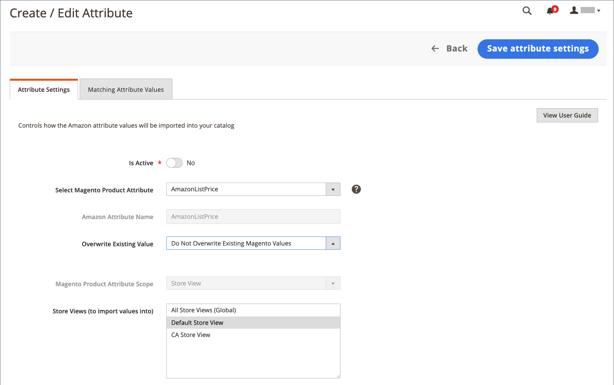

# 创建和编辑属性

创建或更新 [!DNL Commerce] 通过Amazon销售并更新商店时的属性。 查看当前的Amazon属性和链接的 [!DNL Commerce] 属性通过 [_[!UICONTROL Attributes]_视图](./attributes-view.md) Amazon sales channel主页的。 此_[!UICONTROL Action]_ 列显示该属性的可用操作。 您可以创建和映射新的 [!DNL Commerce] Amazon属性，或者您可以编辑现有的 [!DNL Commerce] 属性及其到Amazon属性的映射。

创建和更新属性时，可能需要验证以下项的属性值： [!DNL Commerce] 和Amazon产品。 如果不从Amazon同步和导入值，这些值可能会有所不同。 要检查这些属性的Amazon值，请参阅 [查看Amazon属性映射](./amazon-matching-attributes-values.md). 如果要更改这些值，您可以 [编辑或创建映射](./amazon-manually-update-incomplete-listing.md) 在Amazon和 [!DNL Commerce].

## 创建属性 {#create-an-attribute}

这些步骤会创建 [!DNL Commerce] 属性并将其映射到Amazon属性。 根据配置，值可能会开始在不同目录之间同步。

1. 在 _管理员_ 侧栏，转到 **[!UICONTROL Marketing]** > _[!UICONTROL Channels]_>**[!UICONTROL Amazon Sales Channel]**.

1. 单击 **[!UICONTROL Attributes]** 在左侧菜单中，找到Amazon属性，然后单击 **[!UICONTROL Create Attribute]** 在 _[!UICONTROL Action]_列。

1. 启用将Amazon值与链接的值同步的功能 [!DNL Commerce] 属性，设置 **[!UICONTROL Is Active]** 到 `Yes`.

   当设置为 `Yes`，则值会根据您的配置进行同步。

1. 选择 `Create New Magento Attribute` 对象 **[!UICONTROL Select Magento Product Attribute]**.

   属性映射到为以下项选择的 **[!UICONTROL Amazon Attribute Name]**.

1. 输入 **[!UICONTROL Magento Product Attribute Name]**.

1. 输入 **[!UICONTROL Magento Product Attribute Code]**.

   该值必须全部为小写且不含空格。

1. 对象 **[!UICONTROL Attribute Set Ids]**，选择要分配的属性集。

   通常，属性是属性集的一部分，例如具有蓝色、绿色、黄色和红色属性的颜色集。

1. 对象 **[!UICONTROL Type]**&#x200B;中，选择属性值的类型，如文本和数字。

   此选项影响属性的允许值。

1. 对象 **[!UICONTROL Use for Promo Rule Conditions]**，设置为 `Yes` 以使属性可用于促销条件中的参数。

1. 对象 **[!UICONTROL Used in Search]**，设置为 `Yes` 如果属性和值可用于产品搜索，则为。

1. 对象 **[!UICONTROL Comparable on Storefront]**，设置为 `Yes` 属性值能否在Amazon的“比较依据”功能中使用。

1. 选择 [!DNL Commerce] [范围](https://experienceleague.adobe.com/docs/commerce-admin/start/setup/websites-stores-views.html#scope-settings) ，然后选择一个或多个要将Amazon值导入到的存储视图。

   如果范围设置为 `Global`，则 _[!UICONTROL Store View]_创建属性后无法更改。

   如果您选择 `All Store Views (Global)`，它会同步值并将其保存到您的所有Amazon商店视图。 您可能只想将值同步到特定的存储视图。

1. 完成后，单击 **[!UICONTROL Save Attribute Settings]**.

保存后，您可能需要编辑属性以检查设置并匹配Amazon和 [!DNL Commerce] 属性的值。 您还可以指示Amazon值是否应覆盖 [!DNL Commerce] 值。

{width="600" zoomable="yes"}

| 字段 | 描述 |
|--- |--- |
| [!UICONTROL Is Active] | 指示此属性是否在Amazon和之间处于活动同步状态 [!DNL Commerce]. 设置为 `Yes` 确保Amazon中的属性值和 [!DNL Commerce] 保持所选属性的同步。 |
| 选择Magento产品属性 | 指示要链接到所列Amazon属性名称的选定属性。 创建属性时，选择 `Create New Magento Attribute`. |
| [!UICONTROL Amazon Attribute Name] | 显示您选择的Amazon属性的名称。 选定的属性链接到此Amazon属性。 不能通过编辑此值 [!DNL Commerce]. |
| [!UICONTROL Magento Product Attribute Name] | 指示属性名称或“标签”。 |
| [!UICONTROL Magento Product Attribute Code] | 指示属性代码，全部为小写字符，不含空格。 |
| [!UICONTROL Attribute Set Ids] | 指示要为其分配属性的属性集。 属性往往是属性集的一部分，例如具有蓝色、绿色、黄色和红色属性的颜色集。 |
| [!UICONTROL Type] | 指示属性值的值类型，如文本和数字。 该选择会影响属性的允许值。 |
| [!UICONTROL Use for Promo Rule Conditions] | 切换到 `Yes` 以使属性可用于促销条件中的参数。 |
| [!UICONTROL Used in Search] | 指示属性和值是否可用于产品搜索。 |
| [!UICONTROL Comparable on Storefront] | 指示属性值是否可以在Amazon的“比较依据”功能中使用。 |
| [!UICONTROL Magento Product Attribute Scope] | 指示 [范围](https://experienceleague.adobe.com/docs/commerce-admin/start/setup/websites-stores-views.html#scope-settings) 属性的。 选项：全局/商店视图 当设置为 `Global`，创建属性后无法编辑“商店视图” 。 |
| [!UICONTROL Store Views (to import values into to)] | 仅在范围设置为时显示 `Store View`. 选择 [商店视图](https://experienceleague.adobe.com/docs/commerce-admin/start/setup/websites-stores-views.html) Amazon属性值的同步目标。 选择 `All Store Views (Global)` 更新全部的值 [!DNL Commerce] 商店视图。 |

## 编辑属性 {#edit-an-attribute}

1. 在 _管理员_ 侧栏，转到 **[!UICONTROL Marketing]** > _[!UICONTROL Channels]_>**[!UICONTROL Amazon Sales Channel]**.

1. 单击 **[!UICONTROL Attributes]** 在左侧菜单中，找到Amazon属性，然后单击 **[!UICONTROL Edit]** 在 _[!UICONTROL Action]_列。

1. 启用或禁用Amazon值与链接的同步 [!DNL Commerce] 属性，设置 **处于活动状态** 到 `Yes` 或 `No`.

   当设置为 `Yes`，则值会根据您的配置进行同步。

1. 对象 **[!UICONTROL Select Magento Product Attribute]**，验证或更新属性以映射到所选的 **[!UICONTROL Amazon Attribute Name]**.

1. 指示是否希望传入的Amazon属性值覆盖现有属性值。

   例如，您可能不希望将Amazon中的价格覆盖到 [!DNL Commerce].

   - **[!UICONTROL Do Not Overwrite Existing Magento Values]**  — 保留值，并为保留不同的值 [!DNL Commerce] 和Amazon商店。

   - **[!UICONTROL Overwrite Existing Magento Values]**  — 覆盖 [!DNL Commerce] 具有传入Amazon值的产品目录。

1. 如果可供编辑，请选择一个或多个 **[!UICONTROL Store Views (to import Amazon values into)]**.

   如果属性是使用 `Global` 范围， _商店视图_ 创建属性后无法更改。

   如果您选择 `All Store Views (Global)`，则会同步值并将其保存到所有存储视图。 您可能只想将值同步到特定的存储视图。

1. 完成后，单击 **[!UICONTROL Save Attribute Settings]**.

{width="600" zoomable="yes"}

| 字段 | 描述 |
|--- |--- |
| [!UICONTROL Is Active] | 指示此属性是否在Amazon和之间处于活动同步状态 [!DNL Commerce]. 设置为 `Yes` 确保Amazon中的属性值和 [!DNL Commerce] 保持所选属性的同步。 |
| [!UICONTROL Select Magento Product Attribute] | 指示选定项 [!DNL Commerce] 要链接到列出的Amazon属性名称的属性。 如果要更改链接的 [!DNL Commerce] 属性，从下拉列表中选择其他属性。 值根据配置进行同步。 |
| [!UICONTROL Amazon Attribute Name] | 显示Amazon属性的名称，如中所定义 [!DNL Amazon Seller Central]. 选定的 [!DNL Commerce] 此Amazon属性的属性链接。 不能通过编辑此值 [!DNL Commerce]. |
| [!UICONTROL Overwrite Existing Value] | 指示Amazon属性值是否覆盖现有 [!DNL Commerce] 值，影响所有具有此功能的产品 [!DNL Commerce] 属性。<ul><li>**不覆盖现有Magento值**  — （默认）保留 [!DNL Commerce] 值，保留不同的值 [!DNL Commerce] 和Amazon商店。</li><li>**覆盖现有Magento值**  — 将Amazon值保存在 [!DNL Commerce] 中的值 [!DNL Commerce] 产品目录。</li></ul> |
| [!UICONTROL Magento Product Attribute Scope] | 编辑属性时不会显示(如果属性是使用 `Global` 范围。 指示 [!DNL Commerce] [范围](https://experienceleague.adobe.com/docs/commerce-admin/start/setup/websites-stores-views.html#scope-settings) 创建并设置为 `Store View`. |
| [!UICONTROL Store Views (to import values into to)] | 选择您的 [!DNL Commerce] [商店视图](https://experienceleague.adobe.com/docs/commerce-admin/start/setup/websites-stores-views.html) ，以将Amazon属性值同步到其中。 选择 `All Store Views (Global)` 会更新所有商店视图中的值。 |
