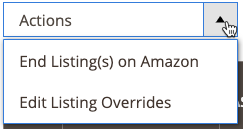

# 创建和编辑覆盖

您可以为列表创建和覆盖，也可以编辑或删除已应用于列表的覆盖。 覆盖为特定列表设置定义的值。

## 为单个列表创建覆盖

查看&#x200B;_[!UICONTROL Inactive]_、_[!UICONTROL Active]_&#x200B;和&#x200B;_[!UICONTROL Ineligible]_选项卡上的列表时，可以使用_[!UICONTROL Create Override]_&#x200B;操作。

1. 查看&#x200B;_[!UICONTROL Products Listings]_页面（_[!UICONTROL Inactive]_、_[!UICONTROL Active]_和_[!UICONTROL Ineligible]_&#x200B;选项卡）上的列表。

1. 在&#x200B;_[!UICONTROL Action]_列中，单击&#x200B;**[!UICONTROL Select]**>**[!UICONTROL Create Override]**以打开“产品列表覆盖”页面。

   

1. 要确保查看正确的列表，请验证&#x200B;_[!UICONTROL Listing Details]_。

1. 确定要创建的覆盖类型。

   您可以为列表定义单个改写类型或任何类型组合（价格、处理时间、条件、销售者附注）。

   - **价格**  — 单 **[!UICONTROL Change Listing Price]** 击并输入定义的价 **[!UICONTROL Price Override]**&#x200B;值。
   - **处理时间**  — 单 **[!UICONTROL Change Handling Time]** 击并输入的定义时间值(以天为单 **[!UICONTROL Handling Time Override]**&#x200B;位)。
   - **条件**  — 单 **[!UICONTROL Change Condition]** 击并为选择正确的选 **[!UICONTROL Condition Override]**&#x200B;项。
   - **卖家说明**  — 单击， **[!UICONTROL Change Seller Notes]** 然后输入您的说明文 **[!UICONTROL Seller Notes Override]**&#x200B;本。

1. 单击&#x200B;**[!UICONTROL Save Listing Override]**。

   _[!UICONTROL Product Listing Overrides]_页面将关闭。 列表的状态将更改为`Relist in Progress`。 所做的更改将随下次数据同步一起发布到Amazon（在您的cron设置中配置）。 该列表也会添加到_[!UICONTROL Overrides]_&#x200B;选项卡。

以下示例显示了一个覆盖，该覆盖定义了新价格`$55`、新处理时间`1 day`、新条件`Used; Like New`和新的卖家附注文本。

## 编辑或删除单个列表的覆盖 {#edit-override-single-listing}

查看&#x200B;_[!UICONTROL Overrides]_选项卡上的列表时，可以使用_[!UICONTROL Edit Overrides]_&#x200B;操作。

1. 查看&#x200B;_[!UICONTROL Product Listings]_页面（_[!UICONTROL Overrides]_&#x200B;选项卡）上的列表。

1. 在&#x200B;_[!UICONTROL Action]_列中，单击&#x200B;**[!UICONTROL Select]**>**[!UICONTROL Edit Overrides]**。

   将打开&#x200B;_[!UICONTROL Product Listing Overrides]_页面。

   

1. 要确保覆盖正确的列表，请验证&#x200B;_[!UICONTROL Listing Details]_。

1. 要编辑&#x200B;_[!UICONTROL Override]_设置，请为要更改的类型（价格、处理时间、条件、销售者附注）定义各个部分。

   若要使覆盖类型保持相同，请选择`No Change To <override type>`（默认）。 此设置会保持先前定义的覆盖值不变。

   - **价格**  — 单 **[!UICONTROL Change Listing Price]** 击并输入定义的价 **[!UICONTROL Price Override]**&#x200B;值。
   - **处理时间**  — 单 **[!UICONTROL Change Handling Time]** 击并输入的定义时间值(以天为单 **[!UICONTROL Handling Time Override]**&#x200B;位)。
   - **条件**  — 单 **[!UICONTROL Change Condition]** 击并选择正确的选 **[!UICONTROL Condition Override]**&#x200B;项。
   - **卖家说明**  — 单击， **[!UICONTROL Change Seller Notes]** 然后输入您的说明文 **[!UICONTROL Seller Notes Override]**&#x200B;本。

1. 要删除覆盖类型，请对要删除的每种类型单击&#x200B;**删除**。 如果未删除，则之前定义的值将保留在覆盖中。

1. 单击&#x200B;**[!UICONTROL Save Listing Override]**。

   _[!UICONTROL Product Listing Overrides]_页面将关闭。 列表的状态将更改为`Relist in Progress`。 所做的更改将随下次数据同步一起发布到Amazon（在您的cron设置中配置）。 如果尚未列出，则还会将列表添加到_[!UICONTROL Overrides]_&#x200B;选项卡。

借用&#x200B;_创建覆盖_&#x200B;示例。 以下示例显示了对先前创建的改写的编辑，该改写定义了`$50`的新价格，删除了处理时间改写，并保留了以前的条件和卖方附注改写。

__

## 编辑或删除多个列表的覆盖 {#edit-override-multiple-listings}

_[!UICONTROL Edit Listing Overrides]_操作可在_[!UICONTROL Inactive]_、_[!UICONTROL Active]_、_[!UICONTROL Overrides]_&#x200B;和&#x200B;_[!UICONTROL Ineligible]_选项卡上使用。

>[!NOTE]
>
>由于您正在修改多个列表的覆盖，因此&#x200B;_[!UICONTROL Listing Details]_部分不会像修改单个列表时一样显示。

1. 查看&#x200B;_[!UICONTROL Products Listings]_页面（_[!UICONTROL Inactive]_、_[!UICONTROL Active]_、_[!UICONTROL Overrides]_&#x200B;和&#x200B;_[!UICONTROL Ineligible]_选项卡）上的列表。

1. 选中每个要修改的列表左侧列中的复选框。

1. 在&#x200B;_[!UICONTROL Actions]_下，单击&#x200B;**[!UICONTROL Edit Listing Overrides]**。

   将打开&#x200B;_[!UICONTROL Product Listing Overrides]_页面。

   

1. 要编辑&#x200B;_[!UICONTROL Override]_设置，请为要更改的类型（价格、处理时间、条件、销售者附注）定义各个部分。

   要保持覆盖相同，请选择`No Change To <override type>`（默认）。 此设置会保持先前定义的覆盖值不变。

   - **价格**  — 单 **[!UICONTROL Change Listing Price]** 击并输入定义的价 **[!UICONTROL Price Override]**&#x200B;值。
   - **处理时间**  — 单 **[!UICONTROL Change Handling Time]** 击并输入的定义时间值(以天为单 **[!UICONTROL Handling Time Override]**&#x200B;位)。
   - **条件**  — 单 **[!UICONTROL Change Condition]** 击并选择正确的选 **[!UICONTROL Condition Override]**&#x200B;项。
   - **卖家说明**  — 单击， **[!UICONTROL Change Seller Notes]** 然后输入您的说明文 **[!UICONTROL Seller Notes Override]**&#x200B;本。

1. 要删除覆盖类型，请单击&#x200B;**[!UICONTROL Remove]**&#x200B;以查看要删除的每种类型。 如果未删除，则之前定义的值将保留在覆盖中。

1. 单击&#x200B;**[!UICONTROL Save Listing Override]**。

   _[!UICONTROL Product Listing Overrides]_页面将关闭。 列表的状态将更改为`Relist in Progress`。 所做的更改将随下次数据同步一起发布到Amazon（在您的cron设置中配置）。 如果尚未列出，则还会将列表添加到_[!UICONTROL Overrides]_&#x200B;选项卡。

### 覆盖类型

| 覆盖 | 描述 |
|--- |--- |
| [!UICONTROL Price Override] | 价格覆盖可定义列表的价格。 在删除覆盖之前，此覆盖优先于所有自动设置。  要覆盖产品的价格，请选 **[!UICONTROL Change Listing Price]** 择并输入新的价 **[!UICONTROL Price Override]**&#x200B;格。 |
| [!UICONTROL Handling Time Override] | 处理时间覆盖定义处理和发运产品所花费的时间（以天为单位）。 处理时间覆盖优先于所有自动和默认的处理时间设置，直到删除覆盖为止。  框中存在的值是您在列表设 _[!UICONTROL Handling Time Override]_置中定义的默认处理时间，或 [者](./listing-settings.md) 定义的覆盖处理时间。如果删除处理时间覆盖，则列表将默认为列表设置中定义的处理时间。  要定义处理时间覆盖，请选&#x200B;**[!UICONTROL Change Handling Time]**择并输入的新处理时间（以天为单位）**[!UICONTROL Handling Time Override]**。 |
| [!UICONTROL Condition Override] | 要覆盖列表条件，请选择&#x200B;**[!UICONTROL Change Condition]**，然后从&#x200B;**条件覆盖**&#x200B;中选择新条件。 |
| [!UICONTROL Seller Notes Override] | 对于目录中定义了除`New`以外的条件的产品，可添加销售者备注，以进一步详细说明您的产品及其条件给潜在购买者。 您可以为`New`条件产品输入销售商备注改写，但Amazon不显示该备注。  要改写“卖方附注”，请选 **[!UICONTROL Change Seller Notes]** 择并输入新附注以供 **[!UICONTROL Seller Notes Override]**&#x200B;使用。 |
