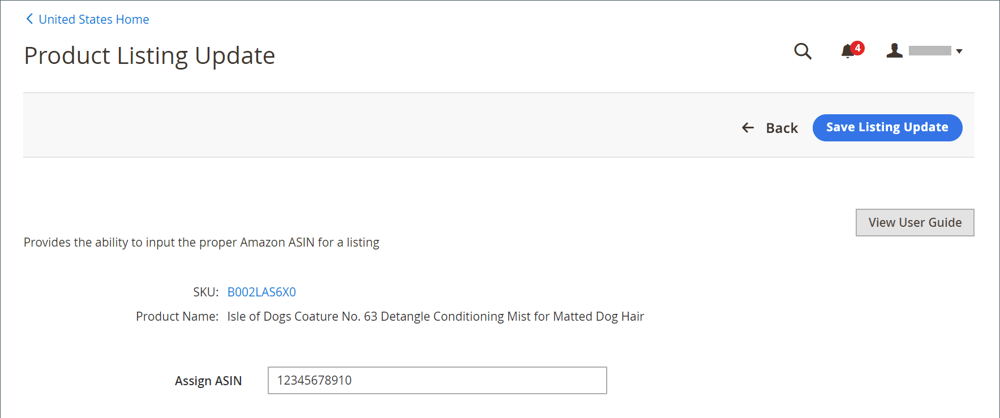

# 编辑分配的ASIN

您可以在[!DNL Commerce]目录中编辑分配给产品的Amazon ASIN值。 如果目录产品与您的某个Amazon列表不正确匹配，则此功能会很有帮助。 更改为列表分配的ASIN不会更改Amazon分配给产品的ASIN。 它只会更改您的目录产品所匹配的Amazon列表。

更改分配的ASIN时：

- [!DNL Commerce]结束您附加到旧ASIN的Amazon列表
- 通过Amazon验证ASIN
- 为更新的ASIN创建列表
- 更新Amazon sales channel中的列表信息

**_要编辑分配的ASIN：_**

1. 查看&#x200B;_[!UICONTROL Product Listings]_页面（_[!UICONTROL Inactive]_、_[!UICONTROL Active]_或_[!UICONTROL Ineligible]_&#x200B;选项卡）上的列表。

1. 在&#x200B;_[!UICONTROL Actions]_下，单击&#x200B;**[!UICONTROL Edit Assigned ASIN]**。

   此操作打开&#x200B;_[!UICONTROL Product Listing Update]_页面。

1. 对于&#x200B;**[!UICONTROL Assign ASIN]**，输入新的ASIN值。

1. 要保存更改，请单击&#x200B;**[!UICONTROL Save Listing Update]**。

{width="600" zoomable="yes"}
