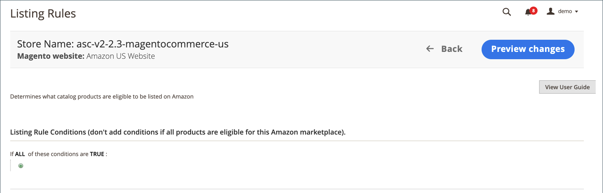

# 上市规则

您可以在中访问商店的列表规则 [存储仪表板](./amazon-store-dashboard.md).

上市规则定义了用于确定哪些产品将发布到AmazonAmazon的销售渠道的规则。 这些规则提供了许多选项，可用于创建简单到复杂的规则，以将产品作为列表进行包含或排除。 每个规则都包含一些条件，用于设置产品列表资格的要求。

您的上市规则会持续与 [!DNL Commerce] 目录。 添加新时 [!DNL Commerce] 对于符合上市规则规定的资格要求的产品，系统会自动处理这些产品以便在Amazon上上市。

- 如果您希望将所有产品发布到Amazon上市，请不要为上市规则定义任何条件。

- 如果要限制发布到Amazon的目录产品，您需要定义列出规则条件。 定义Amazon列表规则的条件时，遵循与定义条件相同的逻辑和过程。 [购物车价格规则](https://docs.magento.com/user-guide/marketing/price-rules-cart.html){target="_blank"}.

- 如果您的列表规则不包括产品，则该产品的资格状态将更改为 `Ineligible`. 不符合条件的产品不会发布到Amazon。

- 如果Amazon上已列出不合格产品，并且您将Amazon列表与您的 [!DNL Commerce] 目录产品，Amazon列表的数量更改为 `0` 以防止产品销售。 Amazon列表可以是 [手动删除](./end-listings-manually.md).

数量和资格状态的更改会影响为同一地区内的商店销售而存在的市场内共享Amazon卖家SKU的所有列表(定义见 _[!UICONTROL Amazon Marketplace Country]_期间 [存储集成](./store-integration.md))。 但是，对共享的更改 [!DNL Amazon Seller SKU] 不会影响产品在其他国家/地区的Amazon列表。

## 配置列表规则设置

1. 单击 **[!UICONTROL Listing Rules]** 在商店仪表板上。

1. 为在Amazon上列出的产品资格定义所需条件。

参见 [示例：定义条件](./ob-define-condition-example.md).

| 字段 | 描述 |
|---|---|
| [!UICONTROL Websites] | 可用选项取决于 [网站](https://docs.magento.com/user-guide/stores/websites-stores-views.html){target="_blank"} 您已在 [!DNL Commerce] 配置。 为Amazon上列出的符合条件的产品选择网站。 只能选择一个网站，因为每个网站都需要在Amazon销售渠道中创建唯一的Amazon商店。 |
| [!UICONTROL Conditions] | 用于定义 [!DNL Commerce] 适用于您的Amazon地区的产品资格属性。 参见 [示例：定义条件](./ob-define-condition-example.md). |

## 条件工作区

在条件中以粗体显示的任何区域都可以单击来查看各种选项。

- 如果所选网站中的所有产品都符合条件，则不添加条件。
- 要直接与Amazon的系统通信，需要一组复杂的后端进程。 根据您尝试列出的项目数量以及Amazon系统可能有多忙（例如“黑色星期五”），在Amazon上列出项目可能需要一些时间。

有关条件的更多信息，请参阅 [描述条件](https://docs.magento.com/user-guide/marketing/price-rules-cart.html){target="_blank"}.

## 列表规则预览

修改列表规则的条件定义时，可以单击 **[!UICONTROL Preview Changes]** 以应用规则更改并查看列表如何受到影响。 在保存列表规则更改之前，请验证此列表预览功能中的列表。

Amazon列表会与您的规则和定义的条件进行比较。 然后，您可以查看：

- 根据您当前的状态，哪些产品会变为不合格状态 [!DNL Amazon Seller Central] 帐户
- 哪些产品从不合格状态移回合格状态
- 哪些产品是新的Amazon列表，并从符合条件添加到您的Amazon列表 [!DNL Commerce] 产品

“列表预览”允许您预览潜在的Amazon列表，并对列表规则进行任何必要的调整。

您的潜在Amazon列表将填充在 _[!UICONTROL Listing Preview]_页面位于以下三个选项卡之一：

- **[!UICONTROL Ineligible Listings]**  — 根据您当前的上市规则和条件，列出的产品不符合Amazon的上市条件。

   不符合条件的产品不会发布到Amazon。 如果Amazon上已列出不合格产品，并且您将Amazon列表与您的 [!DNL Commerce] 目录产品，Amazon列表的数量更改为 `0` 以防止产品销售。 要手动删除列表，请参阅 [结束Amazon列表](./end-listings-manually.md). 此处不列出不符合Amazon要求的产品。 这些产品在 [“非活动列表”标签](./inactive-listings.md).

- **[!UICONTROL Eligible Listings]**  — 根据您当前的上市规则和条件，列出的产品均符合Amazon上市资格并符合Amazon要求。 此列表包括导入的现有Amazon列表(如果您具有 **导入第三方列表** 设置为 `Import Listing` 在 [列表设置](./third-party-listing-settings.md))。

- **[!UICONTROL New Listings]**  — 列出的产品包括您的 [!DNL Commerce] 根据您当前的上市规则和条件对最近符合Amazon上市资格条件的产品进行目录，并创建和发布新的Amazon列表。

### 查看列表预览

1. 单击 **[!UICONTROL Listing Rules]** 在商店仪表板上。

1. 查看或添加 [上市规则](./listing-rules.md).

1. 修改您的 [列表规则条件](./ob-define-condition-example.md).

1. 单击 **[!UICONTROL Preview Changes]**.

1. 查看并确认您在 _[!UICONTROL Ineligible Listings]_，_[!UICONTROL Eligible Listings]_、和 _[!UICONTROL New Listings]_选项卡。

1. 如果您的列表与预期相符，请单击 **[!UICONTROL Save and close]**.

   如果您的列表未按预期显示，请单击 **[!UICONTROL Back]** 并修改您的规则和条件，直到您的清单符合您的期望为止。

### 列出预览记录

| 字段 | 描述 |
|--- |--- |
| [!UICONTROL Product ID] | 分配给的唯一序列号 [!DNL Commerce] 添加时显示的目录产品。 |
| [!UICONTROL Thumbnail] | 显示主要产品图像的缩略图。 |
| [!UICONTROL Name] | 产品的名称，在 [!DNL Commerce] [产品网格](https://docs.magento.com/user-guide/catalog/products.html){target="_blank"}. |
| [!UICONTROL Type] | 产品的类型，在 [!DNL Commerce] 产品网格。 |
| [!UICONTROL Attribute Set] | 用作产品模板的属性集名称，在中管理 [!DNL Commerce] 产品网格。 |
| [!UICONTROL SKU] | 分配给产品的唯一库存单位，在 [!DNL Commerce] 产品网格。 |
| [!UICONTROL Visibility] | 指示产品的可见位置，在中进行管理 [!DNL Commerce] 产品网格。 选项：<ul><li>`Not visible individually`</li><li>`Catalog`</li><li>`Search`</li><li>`Catalog, Search`</li></ul> |
| 状态 | 指示产品的状态，在 [!DNL Commerce] 产品网格。 选项： `Enabled` / `Disabled` |

