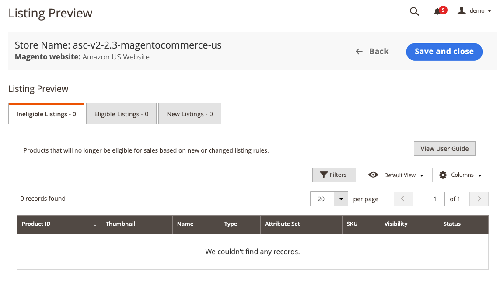

# 入门：创建列表规则

上市规则可以在载入期间定义，但也可以随时修改。 入门后，您可以访问 [列表规则](./listing-rules.md) 在商店上 [仪表板](./amazon-store-dashboard.md).

## 在载入过程中创建列表规则

1. 连接商店后，单击 **[!UICONTROL View Store]** 添加的商店。

   商店 [仪表板](./amazon-store-dashboard.md) 显示为 `No products listed to Amazon` 消息。

1. 单击 **[!UICONTROL Preview and List Eligible Products]**.

   的 _[!UICONTROL Listing Rules]_页面。

1. 为要在Amazon上列出的产品的资格定义所需的条件，然后单击 **[!UICONTROL Preview changes]**，或单击 **[!UICONTROL Preview changes]** 跳过此步骤。

   请参阅 [示例：定义条件](./ob-define-condition-example.md).

1. 在列表预览中查看您的列表：

   

   - **[!UICONTROL Ineligible Listings]**  — 根据您当前的列表规则设置，此选项卡上列出的产品不符合Amazon列表的条件。

      不合格的产品不会发布到Amazon。 如果Amazon上已列出不符合条件的产品，并且您将Amazon列表与 [!DNL Commerce] 目录产品，Amazon列表的数量将更改为 `0` 以防止产品销售。 要手动从Amazon中删除列表，请参阅 [结束Amazon列表](./end-listings-manually.md). 此处未列出不符合Amazon要求的产品。 这些产品列在 [[!UICONTROL Inactive Listings] 选项卡](./inactive-listings.md).

      更改 `Ineligible` 列到 `Eligible` 列表，重复此过程并修改您的列表规则。

   - **[!UICONTROL Eligible Listings]**  — 根据您当前的列表规则设置，此选项卡上列出的产品有资格获得Amazon列表，并符合Amazon要求。 此选项卡包含您已导入的现有Amazon列表(如果您 **[!UICONTROL Import Third Party Listings]** 设置为 `Import Listing` 在 [列表设置](./listing-settings.md))。

   - **[!UICONTROL New Listings]**  — 此选项卡上列出的产品包括 [!DNL Commerce] 根据您当前的列表规则设置和创建Amazon列表，新符合Amazon列表的目录产品。

1. 完成后，单击 **[!UICONTROL Save and Close]**.

   商店 [仪表板](./amazon-store-dashboard.md) 打开。

载入存储完成后，将在 [!DNL Commerce] 而Amazon也启动了。 您的Amazon列表将导入 [!DNL Commerce] 并尝试与 [!DNL Commerce] 目录。

您可以在 _[!UICONTROL Recent Orders]_区域。 请参阅 [存储功能板](./amazon-store-dashboard.md) 或 [管理订单](./managing-orders.md).

>[!IMPORTANT]
>
>一些重要的商店设置（列表、定价、规则、履行等）具有新商店的默认值。 要确保您的商店已根据您的特定需求进行设置，请查看 [存储设置](./default-store-settings.md) .

 [**继续使用默认商店设置**](./default-store-settings.md)
