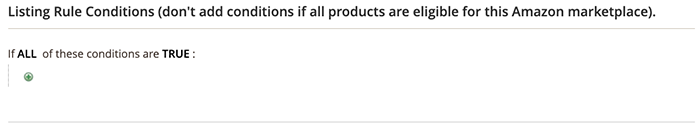

# 示例：定义条件

## 条件

在条件中以粗体显示的任何区域都可以单击来查看各种选项。

**如果所选网站中的所有产品都符合条件，请勿添加条件。**

>[!NOTE]
>
>要直接与Amazon的系统通信，需要一组复杂的后端流程。 根据您尝试列出的项目数量以及Amazon系统可能有多忙（例如“黑色星期五”），在Amazon上列出项目可能需要一些时间。

请参阅的条件部分 [创建购物车价格规则](https://experienceleague.adobe.com/docs/commerce-admin/marketing/promotions/catalog-rules/price-rules-catalog-create.html).

## 定义条件

此过程可能比较简单或详细，具体取决于您的目录设置。 您可以设置条件，以便 `ALL` 或 `ANY` 的定义条件为 `TRUE` 或 `FALSE` 对于产品，则该产品有资格在Amazon上列出。

条件基于现有的产品属性值。 要将规则应用于所有产品，请将条件部分留空。

>[!NOTE]
>
>如果要根据特定产品属性定义条件，请设置 **[!UICONTROL Use for Promo Rule Conditions]** 将属性设置为 `Yes`. 您可以在以下位置访问此设置： [店面属性](https://experienceleague.adobe.com/docs/commerce-admin/catalog/product-attributes/product-attributes-add.html) 属性的页面。

{width="500"}

Amazon此示例中的规则定义了一个规则，该规则用于为具有 _AMAZON FBA_ 属性设置为 `Yes`.

规则语句有两个粗体链接，单击这两个链接时，将显示该语句部分的选项。 如果保存条件时没有更改粗体选项，则该规则将应用于您的所有产品。

- 单击 **[!UICONTROL ALL]** 然后选择 `ALL` 或 `ANY`.
- 单击 **[!UICONTROL TRUE]** 并选择 `TRUE` 或 `FALSE`.
- 要将规则应用于所有产品，请保留条件不变。

您可以通过更改这些值的组合来创建不同的条件。 对于此示例，使用以下条件：

`If ALL of these conditions are TRUE:`

1. 单击添加()图标并选择作为条件基础的属性，如条件组合或产品属性。

   - **[!UICONTROL Conditions Combination]**  — 选择以允许创建另一组 `All/Any` 和 `True/False` 现有集内的条件。

     {width="500"}

   - **[!UICONTROL Product Attribute]**  — 产品属性取决于属性的设置。 要使属性显示在列表中，必须将其配置为在促销规则条件中使用。 请参阅 _用于促销规则条件_ 在 [产品属性](https://experienceleague.adobe.com/docs/commerce-admin/catalog/product-attributes/product-attributes.html).

     在下面的列表中 **[!UICONTROL Product Attribute]**，选择要用作条件基础的属性。 对于此示例，选定的条件为 `Amazon FBA`.

     {width="350"}

     选定的条件将显示在语句中，后面还有两个粗体链接。 选项因您选择的产品属性而异。

     设置属性后，无法对其进行更改。 要更改属性，必须删除该行并添加新属性。 您可以通过单击删除()图标。

      1. 单击 **[!UICONTROL is]** 并选择描述要满足的产品条件的比较运算符。

         对于此示例，比较运算符为 `is`. 可用的选项取决于上一步骤中选择的属性。 选项可以包括不同的比较选项，例如匹配值，不包括或包括值、大于、等于和小于数字量中的至少一个。 在此示例中，选项包括 `is` 和 `is not`.

      1. 单击 **[!UICONTROL ...]** 并选择条件所依据的属性值。

         选项取决于属性的设置。 系统可能会提示您选择一个选项，或者输入条件的文本或数值。 对于此示例，选择为 `Yes`.

         选定的项目会显示在语句中，以完成条件。

         {width="500"}

   此条件已完成。 如上所述，此条件表示贵机构中 [!DNL Commerce] 将Amazon FBA属性设置为值的目录 `Yes` 有资格在该地区和商店中列为Amazon。 您可以添加更多条件行，以进一步缩小合格产品的范围。

1，要向语句中添加其他条件行，请返回到步骤1并重复该过程，直到所有所需条件都完成。

您可以随时通过单击删除()图标。
