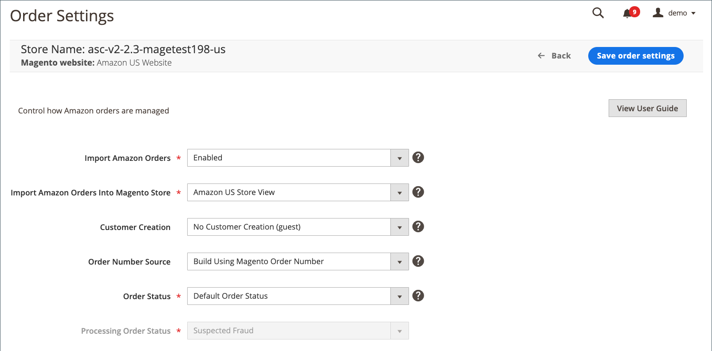

# Amazon订单设置

订单设置定义是否以及如何将Amazon订单导入并在中进行处理 [!DNL Commerce] 并可在 [存储仪表板](./amazon-store-dashboard.md).

订单导入设置设置为 `Enabled` 默认情况下，这意味着您的Amazon订单显示在商店仪表板上，并创建相应的 [!DNL Commerce] 订单。 导入的订单可在以下位置管理： [!DNL Commerce] [订购](https://experienceleague.adobe.com/docs/commerce-admin/stores-sales/order-management/orders/orders.html) 工作流。

>[!NOTE]
>
>无论您的订单设置如何，都不会导入应用商店集成之前存在的Amazon订单。

之后 [存储集成](./store-integration.md) 完成，您可以更改订单设置。 如果您将订单设置设置为 `Disabled`，Amazon订单会显示在商店仪表板上，但必须在您的商店中进行管理。 [!DNL Amazon Seller Central] 帐户。

在Amazon中创建订单时，不会立即将其导入 [!DNL Commerce]. Amazon分配 `Pending` 新创建订单的状态。 在Amazon验证订单和支付方式后，订单的状态将更改为 `Unshipped`. 此状态更改会触发订单导入，并且 [!DNL Commerce] 创建匹配的、对应的顺序。

从Amazon导入的订单可在以下位置管理： [!DNL Commerce] [订单工作流](https://experienceleague.adobe.com/docs/commerce-admin/stores-sales/order-management/orders/orders.html). 另请参阅 [管理订单](./managing-orders.md).

## 配置订单设置 {#configure-order-settings}

1. 单击 **[!UICONTROL Order Settings]** 在商店仪表板上。

1. 对象 **[!UICONTROL Import Amazon Orders]** （必需），选择一个选项：

   - `Disabled`  — 选择您不想在中创建相应订单的时间 [!DNL Commerce] 从Amazon收到新订单时。 选中后，将禁用此页上的所有其他字段。

   - `Enabled`  — （默认）选择何时创建对应的 [!DNL Commerce] 订单在从Amazon收到新订单时。 [!DNL Commerce] 根据Amazon状态和库存水平创建订单。

     >[!NOTE]
     >
     >导入Amazon订单必须设置为 `Enabled` 在中管理Amazon订单 [!DNL Commerce] [订单](https://experienceleague.adobe.com/docs/commerce-admin/stores-sales/order-management/orders/orders.html) 工作流。 当设置为 `Disabled`，您的Amazon订单中没有与 [!DNL Commerce] 订单编号，不能在中管理 [!DNL Commerce]. 您可在以下位置管理这些订单 [!DNL Amazon Seller Central] 帐户。

1. 对象 **[!UICONTROL Import Amazon Orders Into Magento Store]**，选择所需的 [!DNL Commerce] 存储在中创建相应订单时与之关联的Amazon订单 [!DNL Commerce].

   对于您选择的Web站点，此设置默认为商店视图 [添加了Amazon store](./store-integration.md). 如果要更改此设置，选项列表取决于 [!DNL Commerce] 已设置的商店。 请参阅 [商店](https://experienceleague.adobe.com/docs/commerce-admin/stores-sales/site-store/store-views.html).

1. 对象 **[!UICONTROL Customer Creation]**，选择一个选项：

   - `No Customer Creation (guest)`  — （默认）选择何时不想在中创建客户帐户 [!DNL Commerce] 使用从Amazon订单中导入的客户数据。 选择后， [!DNL Commerce] 处理导入的Amazon订单的方式与在中处理访客结帐的方式相同 [!DNL Commerce].

   - `Build New Customer Account`  — 选择要在其中创建新客户帐户的时间 [!DNL Commerce] 使用随Amazon订单导入的客户数据。 此选项有助于根据Amazon订单构建客户数据库。

1. 对象 **[!UICONTROL Order Number Source]**，选择一个选项：

   - `Build Using Magento Order Number`  — （默认）选择何时要创建唯一 [!DNL Commerce] 使用的Amazon对应订单的订单编号 [!DNL Commerce] 增量分配的订单ID。

   - `Build Using Amazon Order Number`  — 选择您希望创建 [!DNL Commerce] 订单编号，使用相应的Amazon分配的订单编号。

   >[!NOTE]
   >
   >导入订单后，Amazon订单编号将显示在 _[!UICONTROL Recent Orders]_商店仪表板上的列表。 此 [!DNL Commerce] 在中查看订单详细信息时显示的订单编号 [!DNL Commerce] [订购](https://experienceleague.adobe.com/docs/commerce-admin/stores-sales/order-management/orders/orders.html) 工作区。

1. 对象 **[!UICONTROL Order Status]** （必需），选择一个选项：

   - `Default Order Status`  — （默认）选择何时希望为从Amazon导入的新创建订单分配您为新订单定义的默认订单状态。 新订单的默认状态（除非您为新订单创建了自定义订单状态）为 `Pending`. 请参阅 [处理订单](https://experienceleague.adobe.com/docs/commerce-admin/stores-sales/order-management/orders/order-processing.html#process-an-order).

   - `Custom Order Status`  — 选择何时希望为从Amazon导入的新创建订单分配默认状态以外的状态。

   - `Processing Order Status`  — 在以下情况下启用 **[!UICONTROL Order Status]** 设置为 `Custom Order Status`. 选择要用于从Amazon导入的新创建订单的状态。 此字段中的选项基于中的默认状态选项 [!DNL Commerce]. 请参阅 [订单状态](https://experienceleague.adobe.com/docs/commerce-admin/stores-sales/order-management/orders/order-status.html). 您还可以创建自定义订单状态，以在此处显示以供选择。 要创建自定义订单状态，请参阅 [自定义订单状态](https://experienceleague.adobe.com/docs/commerce-admin/stores-sales/order-management/orders/order-status.html#custom-order-status).

1. 完成后，单击 **[!UICONTROL Save order settings]**.

{width="600" zoomable="yes"}

| 字段 | 描述 |
|------------------------------------------------------|-------------------------------------------------------------------------------------------------------------------------------------------------------------------------------------------------------------------------------------------------------------------------------------------------------------------------------------------------------------------------------------------------------------------------------------------------------------------------------------------------------------------------------------------------------------------------------------------------------------------------------------------------------------------------------------------------------------------------------------------------------------------------------------------------------------|
| [!UICONTROL Import Amazon Orders] | 选项：<ul><li>**[!UICONTROL Disabled]**  — 选择您不想在中创建相应订单的时间 [!DNL Commerce] 从Amazon收到新订单时。 选中后，将禁用此页上的所有其他字段。</li><li>**[!UICONTROL Enabled]**  — （默认）选择何时创建对应的 [!DNL Commerce] 订单在从Amazon收到新订单时。 [!DNL Commerce] 根据Amazon状态和库存水平创建订单。</li></ul>  `Enabled` 必须选择此项以管理Amazon订单 [!DNL Commerce]. 时间 `Disabled` ，则您的Amazon订单会显示在商店仪表板上，但必须在您的商店中 [!DNL Amazon Seller Central] 帐户。 |
| [!UICONTROL Import Amazon Orders Into Magento Store] | 选择哪个 [!DNL Commerce] 存储在中创建订单时与之关联的Amazon订单 [!DNL Commerce] [订购](https://experienceleague.adobe.com/docs/commerce-admin/stores-sales/order-management/orders/orders.html) 工作区。 此设置默认为“存储视图” [!DNL Commerce] 在以下情况下选择的网站： [添加了Amazon store](./store-integration.md). 如果要更改此设置，选项列表取决于 [!DNL Commerce] 已设置的商店。 请参阅 [商店](https://experienceleague.adobe.com/docs/commerce-admin/stores-sales/site-store/stores.html). |
| [!UICONTROL Customer Creation] | 选项：<ul><li>**[!UICONTROL No Customer Creation (guest)]**  — （默认）选择何时不想在中创建客户帐户 [!DNL Commerce] 使用从Amazon订单中导入的客户数据。 选择此选项后，此选项将告知 [!DNL Commerce] 以处理导入的Amazon订单，其方式与处理访客结帐的方式相同。</li><li>**[!UICONTROL Build New Customer Account]**  — 选择要在贵机构中创建新客户帐户的时间 [!DNL Commerce] 客户数据库，使用通过Amazon订单导入的客户数据。 此选项有助于构建 [!DNL Commerce] 来自您的Amazon订单的客户数据库。</li></ul> |
| 订单编号来源 | 选项：<ul><li>**[!UICONTROL Build Using Magento Order Number]**  — （默认）选择何时要创建唯一 [!DNL Commerce] 使用的Amazon对应订单的订单编号 [!DNL Commerce] 增量分配的订单ID。 </li><li>**使用Amazon订单号构建**  — 选择您希望创建 [!DNL Commerce] 订单编号，使用相应的Amazon分配的订单编号。</li></ul> |
| 待处理订单 | 选项：<ul><li>**[!UICONTROL Do Not Reserve Quantity]**  — 选择您不想要的 [!DNL Commerce] 受Amazon订单影响的库存数量。 选择您是否将Amazon用于履行流程(FBA)。 选择并接收Amazon订单后，订购数量不会影响 [!DNL Commerce] 库存数量。</li><li>**[!UICONTROL Reserve Quantity]**  — 选择您希望Amazon订单中的订货量在 [!DNL Commerce] 库存数量。 当您选择并收到Amazon订单后，订购数量将“预留”在您的 [!DNL Commerce] 库存数量，以防止您的 [!DNL Commerce] “超卖”的股票。 “预留”数量不能通过 [!DNL Commerce] 店面。</li></ul> |
| [!UICONTROL Order Status] | 选项：<ul><li>**[!UICONTROL Default Order Status]**  — （默认）选择何时希望将从Amazon导入的新创建订单分配新订单的默认订单状态。 新订单的默认状态（除非您为新订单创建了自定义订单状态）为 `Pending`. 请参阅 [处理订单](https://experienceleague.adobe.com/docs/commerce-admin/stores-sales/order-management/orders/order-processing.html#process-an-order).</li><li>**[!UICONTROL Custom Order Status]**  — 选择何时希望为从Amazon导入的新创建订单分配默认状态以外的状态。 选择后， **[!UICONTROL Processing Order Status]** 允许您选择要用于从Amazon导入的新创建订单的状态。</li></ul> |
| [!UICONTROL Processing Orders Status] | 启用时间 _[!UICONTROL Order Status]_设置为 `Custom Order Status`. 选择要分配给新订单的订单状态。 此字段中的选项取决于中的默认状态选项 [!DNL Commerce]. 请参阅 [订单状态](https://experienceleague.adobe.com/docs/commerce-admin/stores-sales/order-management/orders/order-status.html). 您还可以创建要在此处显示的自定义订单状态。 要创建自定义订单状态，请参阅 [自定义订单状态] |

## [!DNL Commerce] 订单创建

[!DNL Commerce] 根据以下状态和库存条件为Amazon订单创建订单。

### 使用Inventory management创建订单

>[!NOTE]
>
>仅在Adobe Commerce和Magento Open Source 2.3.x集成中受支持。

| 履行渠道 | [!DNL Commerce] 库存状态 | Amazon订单状态 | [!UICONTROL Create Magento Order] 设置 | 预留库存 |
|---------------------|-------------------------------------------|---------------------|-------------------------------------------|--------------------|
| FBA | 有货 缺货 不管理 | 待处理 | 否 | 否 |
| FBA | 有货 缺货 不管理 | Pendingavailability | 否 | 否 |
| FBA | 有货 缺货 不管理 | 已取消 | 否 | 否 |
| FBA | 有货 缺货 不管理 | 错误 | 否 | 否 |
| FBA | 有货 缺货 不管理 | 未发货 | 否 | 否 |
| FBA | 有货 缺货 不管理 | 已部分装运 | 否 | 否 |
| FBA | 有货 不管理 | 已发货 | 是 | 否 |
| FBA | 缺货 | 已发货 | 否 | 否 |
| FBM | 有货 缺货 不管理 | 待处理 | 否 | 否 |
| FBM | 有货 缺货 不管理 | Pendingavailability | 否 | 否 |
| FBM | 有货 缺货 不管理 | 已取消 | 否 | 否 |
| FBM | 有货 缺货 不管理 | 错误 | 否 | 否 |
| FBM | 有货 不管理 | 未发货 | 是 | 是 |
| FBM | 缺货 | 未发货 | 否 | 否 |
| FBM | 有货 不管理 | 已部分装运 | 是 | 是 |
| FBM | 缺货 | 已部分装运 | 否 | 否 |
| FBM | 有货 不管理 | 已发货 | 是 | 是 |
| FBM | 缺货 | 已发货 | 否 | 否 |

>[!NOTE]
>如果Amazon订单是在 `Partially Shipped` 或 `Shipped` 状态，为订单中的所有物料创建的库存预留。 Amazon sales channel不对以前发运的项目进行补偿。
>
>如果订单已由Amazon (FBA)履行，但有一个项目在 `out of stock` 状态， [!DNL Commerce] 无法创建相应的订单。 这是Inventory management集成的限制。
