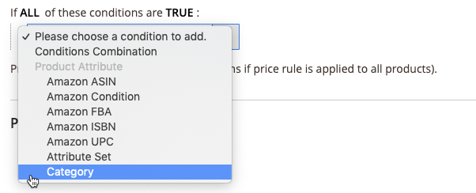

# 价格规则条件

条件决定了哪些产品符合价格规则。 定义Amazon定价规则的条件遵循与在[!DNL Commerce]中定义[购物车价格规则](https://experienceleague.adobe.com/docs/commerce-admin/marketing/promotions/cart-rules/price-rules-cart.html)的条件相同的逻辑和过程。

>[!IMPORTANT]
>
>如果价格规则适用于[!DNL Commerce]目录中的所有产品，则将此部分留空。

在条件中以粗体显示的任何区域都可以单击来查看各种选项。

## 示例：构建价格规则条件

此过程可能简单也可能详细，具体取决于您的目录配置。 您可以定义条件，以便当产品的`ALL`或`ANY`条件为`TRUE`或`FALSE`时，该产品符合要应用的定价规则的条件。

条件基于您的[产品属性](https://experienceleague.adobe.com/docs/commerce-admin/catalog/product-attributes/product-attributes.html)。 要将规则应用于所有产品，请将条件部分留空。

>[!NOTE]
>
>如果要基于特定产品属性定义条件，则必须将该属性的[店面属性](https://experienceleague.adobe.com/docs/commerce-admin/catalog/product-attributes/create/attribute-product-create.html)中的&#x200B;**用于促销规则条件**&#x200B;设置为`Yes`。

{width="600" zoomable="yes"}

此示例定义了一个规则，该规则对`Books`类别中定义的所有产品应用25%折扣。

规则语句具有两个粗体链接，单击这两个链接时，将显示条件语句该部分的选项。 如果保存条件而不更改粗体选项，则该规则将应用于您的所有产品。

- 单击&#x200B;**[!UICONTROL ALL]**&#x200B;并选择`ALL`或`ANY`。
- 单击&#x200B;**[!UICONTROL TRUE]**，然后选择`TRUE`或`FALSE`。
- 要将规则应用于所有产品，请保持条件不变。

您可以通过更改这些值的组合来创建不同的条件。 对于此示例，使用以下条件：

`If ALL of these conditions are TRUE:`

1. 要显示条件适用的可用属性，请单击条件行开头的“添加”（）图标，然后选择要作为条件基础的属性。

   **[!UICONTROL Conditions Combination]** — 选择在现有条件中创建另一组`All/Any`和`True/False`条件。

   {width="500"}

   **[!UICONTROL Product Attribute]** — 可用的产品属性取决于属性](https://experienceleague.adobe.com/docs/commerce-admin/catalog/product-attributes/create/attribute-product-create.html)的[设置。 对于要在列表中显示的属性，必须在店面属性中将属性的&#x200B;*[!UICONTROL Use for Promo Rule Conditions]*&#x200B;设置为`Yes`。

   - 对于&#x200B;**[!UICONTROL Product Attribute]**，选择要定义为条件的基的属性。 对于此示例，选定的条件为`Category`。

     {width="500"}

     选定的条件会显示在语句中，其后是两个粗体链接。 选项因您选择的产品属性而异。

     设置属性后，无法对其进行编辑。 要更改属性，必须删除该行并添加新属性。 您可以通过单击行末的删除（图标）来删除条件行。

   - 单击&#x200B;**[!UICONTROL is]**&#x200B;并选择描述产品满足条件的比较运算符。

     对于此示例，比较运算符为`is`。 可用选项取决于上一步骤中选择的属性，可能包括不同的比较选项。 选项可以包括匹配值，不包括或包括值、大于、等于和小于数值中的至少一个。 在此示例中，选项为`is`和`is not`。

   - 单击&#x200B;**[!UICONTROL ...]**&#x200B;并选择条件所基于的属性值。 选项取决于属性的设置。

     系统可能会提示您选择一个选项或输入条件的值。 对于此示例，字段显示为空白。 要为规则选择您的类别，请单击选择器图标（）以显示您的选择选项。 此规则适用于&#x200B;_书籍_，请选中&#x200B;**[!UICONTROL Books]**&#x200B;复选框。 将填充类别编号。 要接受您的类别选择，请单击绿色复选标记图标（）。

     {width="500"}

     选定的项目会显示在语句中，以完成条件。

     {width="500"}

     此示例条件已完成。 如上所述，此条件意味着[!DNL Commerce]目录中具有已定义书籍类别(`4`)的任何产品均符合此定价规则的条件。 您可以添加更多条件行，以进一步缩小合格产品的范围。

1. 要向语句中添加其他条件行，请返回到步骤1并重复该过程，直到所有所需条件都完成。

   您可以随时通过单击条件语句末尾的删除（）图标来删除该行。
