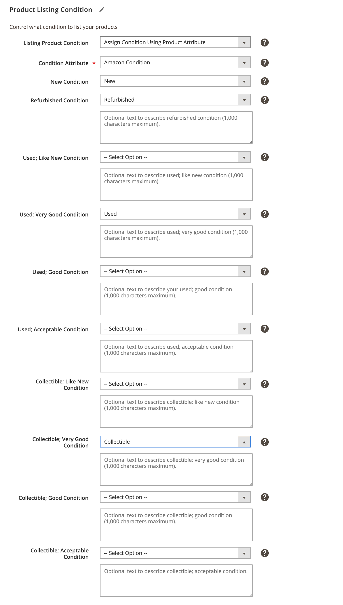

# 产品列表条件

产品清单条件设置是您的商店清单设置的一部分。 您可以在 [存储仪表板](./amazon-store-dashboard.md).

Amazon要求产品列表具有定义的条件。 如果您的所有产品都是相同的条件，则可以选择一个Amazon条件选项，以将您的所有产品表示为全局条件值。 标准Amazon条件包括：

- `New`
- `Refurbished`
- `Used; Like New`
- `Used; Very Good`
- `Used; Good`
- `Used; Acceptable`
- `Collectible; Like New`
- `Collectible; Very Good`
- `Collectible; Good`
- `Collectible; Acceptable`

>[!IMPORTANT]
>
>如果您销售续订（翻新）产品，则必须注册 [!DNL Amazon Renewed Program]. 请参阅 [续订的产品](./renewed-products.md).

但是，如果目录包含不同条件（如“新”、“已用”和“已翻新”）的产品，则必须选择 **[!UICONTROL Assign Condition Using Product Attribute]**. 此设置允许您映射 [!DNL Commerce] 条件属性和值。

期间 [预设置任务](./amazon-pre-setup-tasks.md)，鼓励您创建 [!DNL Commerce] 产品条件的产品属性。 如果您在各种条件下提供产品，并且尚未创建条件属性，请参阅 [在中创建产品属性 [!DNL Commerce]](./ob-creating-magento-attributes.md). 在创建条件属性后，您可以为 [!DNL Commerce] 目录。

## 配置设置

1. 单击 **[!UICONTROL Listing Settings]** 在商店仪表板上。

1. 展开 **[!UICONTROL Product Listing Condition]** 中。

1. 对于 **[!UICONTROL Listing Product Condition]**，选择一个选项。

   为所有列表的全局条件值选择一个标准的Amazon条件。 默认设置为 `New`.

   如果您的产品/列表具有不同的条件，请选择 `Assign Condition Using Product Attribute` 用于在显示的其他字段中定义产品条件设置。

1. 对于 **条件属性**，选择 [!DNL Commerce] 属性来映射每个标准Amazon条件属性的值。

   如果您在 `Used` 或 `Collectible` 条件，但您无法进一步区分，您可以映射到单个 `Used` 或 `Collectible` Amazon条件并将其他内容留空。 此方法将映射 `Used` 或 `Collectible` 单个Amazon Used或Coluble条件的URL。

   例如，您有一个 `Used` 条件。 映射时，您可以选择是否要映射到Amazon条件 `Used; Like New`, `Used; Very Good`, `Used; Good`或 `Used; Acceptable`. 仅填写所需Amazon条件的字段，将另一个 `Used` 选项设置为 `--Select Option--`. 在示例图像中，所有 [!DNL Commerce] 产品 `Used` 条件已映射到Amazon `Used; Very Good` 条件。

   您还可以为条件输入描述性文本，但 `New`.

1. 完成后，单击 **[!UICONTROL Save listing settings]**.

| 字段 | 描述 |
|---|---|
| [!UICONTROL Listing Product Condition] | 您的产品列表的条件。 选项： `New` / `Refurbished` / `Used: Like New` / `Used: Very Good` / `Used: Good` / `Used: Acceptable` / `Collectible: Like New` / `Collectible: Very Good` / `Collectible: Good` / `Collectible: Acceptable` / `Assign Condition Using Product Attribute`  如果您销售的是单个产品条件，请选择一个标准的Amazon条件。 如果 [!DNL Commerce] 目录包含各种条件的产品，请选择 `Assign Condition Using Product Attribute`. |
| [!UICONTROL Condition Attribute] | 的 [!DNL Commerce] 用于定义产品条件的属性。 选择您创建以映射到Amazon条件属性的Mangeto属性。 在 [预设置任务示例](./ob-creating-magento-attributes.md) 建议将其命名为 `Amazon Condition`. 选择后，将显示用于映射标准Amazon条件的其他字段。 |
| [!UICONTROL Additional Condition fields] | 对于每个标准Amazon条件，选择相应的条件。 选项是您在 [创建了Amazon条件属性](./ob-creating-magento-attributes.md).  如果您在 `Used` 或 `Collectible` 条件，但您无法进一步区分，您可以映射到单个 `Used` 或 `Collectible` Amazon条件并将其他内容留空。 此方法映射所有 `Used` 或 `Collectible` 单个Amazon Used或Coluble条件的URL。 |

**快速访问** - [!UICONTROL Listing Settings] 章节

- [[!UICONTROL Product Listing Actions]](./product-listing-actions.md)
- [[!UICONTROL Third Party Listings]](./third-party-listing-settings.md)
- [[!UICONTROL Listing Price]](./listing-price.md)
- [[!UICONTROL (B2B) Business Price]](./business-pricing.md)
- [[!UICONTROL Stock / Quantity]](./stock-quantity.md)
- [[!UICONTROL Fulfilled By]](./fulfilled-by.md)
- [[!UICONTROL Catalog Search]](./catalog-search.md)
- [[!UICONTROL Product Listing Condition]](./product-listing-condition.md)
