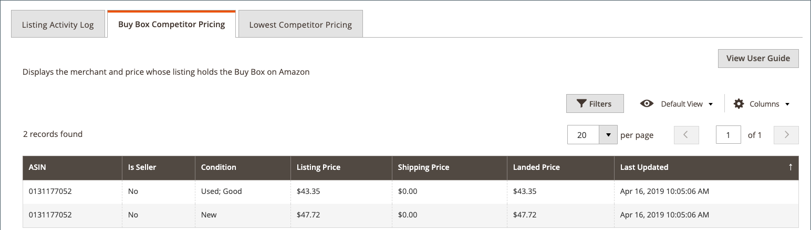

# 查看Amazon列表详细信息

此 _[!UICONTROL Product Listing Details]_页面显示有关活动产品清单的其他信息，包括显示单个SKU/产品更改的列表活动日志。 此信息可帮助您了解关于您的产品以及单个SKU/产品更改的竞争性指标。 此页面上的其他信息包括：

- **[!UICONTROL Listing Details]**  — 产品详细信息，包括名称和Amazon销售商SKU
- **[!UICONTROL Listing Activity Log]**  — 此列表发生的所有更改的历史记录，如定价和数量/库存更改。 无需执行其他操作。 提供此日志以供查看以了解更改历史记录。
- **[!UICONTROL Buy Box Competitor Pricing]**  — 用于Amazon的数据 [[!DNL Buy Box]](./buy-box-competitor-pricing.md) 状态和竞争对手定价
- **[!UICONTROL Lowest Competitor Pricing]**  — 有关最低Amazon竞争对手的定价和反馈信息

Amazon sales channel主页共享一些常见的 [工作区控件](./workspace-controls.md) 允许您自定义显示的数据。

## 列表详细信息

显示的产品信息包括：

- _[!UICONTROL Amazon Name]_
- _[!UICONTROL Catalog (Magento) SKU]_
- _[!UICONTROL Amazon Seller SKU]_

{width="600" zoomable="yes"}

## 列出活动日志 {#listing-activity-log}

显示Amazon列表的所有最近活动。 显示的信息包括：

- Amazon卖方SKU：标识为上市定义的库存单位(SKU)。
- ASIN：标识10位数的Amazon产品标识符。
- 列表活动：标识为列表发生的活动类型。
- 注释：提供与所发生的列表操作类型相关的其他详细信息。
- 执行时间：标识执行操作的日期和时间。

{width="600" zoomable="yes"}
__

## Buy Box竞争对手定价 {#buy-box-competitor-pricing}

此选项卡显示有关持有以下资产的Amazon商家的信息： [[!DNL Buy Box]](./buy-box-competitor-pricing.md) 上市公司的职位。 此信息可用于了解您的竞争对手在Amazon上的价格定位。 显示的信息包括：

- ASIN： 10位数的Amazon产品标识符。
- 是卖方：标识您是否 [!DNL Buy Box] 卖家。 选项是/否。
- 条件：标识为列表定义的条件。
- 挂牌价：确定刊登挂牌时的价格。
- 发运价格：标识添加到清单中的发运价格。
- 到岸价格：标识此列表的上市价格加上发运价格。
- 上次更新时间：确定从Amazon更新定价信息的日期和时间。

{width="600" zoomable="yes"}

## 最低竞争者定价 {#lowest-competitor-pricing}

此选项卡显示有关同一列表的Amazon竞争对手的信息。 此信息可用于了解价格定位和 [最低竞争者定价](./lowest-competitor-pricing.md). 显示的信息包括：

- ASIN： 10位数的Amazon产品标识符。
- 条件：标识为列表定义的条件。
- 履行渠道：确定负责履行的人员。 选项：商家/Amazon。
- 挂牌价：确定刊登挂牌时的价格。
- 发运价格：标识添加到清单中的发运价格。
- 到岸价格：标识此列表的上市价格加上发运价格。
- 反馈评级：确定最低价格商家的Amazon反馈评级。
- 反馈计数：标识最低价格商家的Amazon反馈计数。
- 上次更新时间：确定从Amazon更新定价信息的日期和时间。

{width="600" zoomable="yes"}
