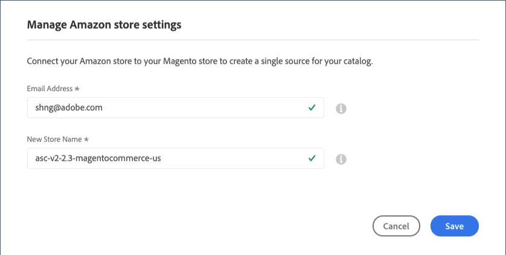

# 存储集成设置

集成您的商店后，请通过 [!UICONTROL Amazon Store] 仪表板。 这些设置显示用于 *不活动* 和 *活动* 商店。 在这里，您可以更改Amazon商店的名称以及在商店集成期间与该商店关联的电子邮件地址。

## 修改商店集成设置

1. 显示商店 [仪表板](./amazon-store-dashboard.md)，单击 **[!UICONTROL View Store]** 在商店卡片上。

1. 单击 **[!UICONTROL Store Integration Settings]** 左侧菜单中的。

1. 对象 **[!UICONTROL Email Address]**，更新您的首选联系人电子邮件地址。

1. 对象 **[!UICONTROL New Store Name]**，请更新新的Amazon sales channel store的描述性名称。

   此名称显示在 [_[!UICONTROL Amazon Stores]_](./managing-stores.md) 选项卡。

   它被用作 [!DNL Commerce] 仅引用和标识Amazon sales channel主页上的列表中的商店。 它应该是您的团队能够轻松识别的东西。 例如，您在美国地区销售的Amazon商店可能会被命名为 `Amazon Store USA`.

1. 单击 **[!UICONTROL Save]**.

>[!NOTE]
>
>此 _[!UICONTROL Amazon Marketplace Country]_设置定义于 [存储集成](./store-integration.md) 无法更新。 要编辑国家/地区设置，您必须删除商店(位于_[!UICONTROL Action]_ ，并为不同的国家/地区添加商店。

