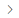

# 存储集成

要开始使用Amazon销售渠道，您必须创建（添加）Amazon销售渠道商店，并将其连接到您的Amazon卖家帐户。 这两个步骤将 [!DNL Commerce] 和Amazon帐户共享数据、同步产品等。

_您需要主登录凭据才能 [!DNL Amazon Seller Central] 帐户（用于创建卖家帐户的电子邮件或电话）连接您的商店。_

>[!NOTE]
>
>首次集成商店后，系统将每年通过再次授予访问权限，提示您续订与Amazon的Amazon销售渠道连接。 您可以在 _当前授权_ 表格 _Amazon MWS开发人员权限_ 部分 **设置** > **用户权限** 销售中心帐户的页面。

## 添加Amazon商店

1. 在 _管理员_ 侧栏，转到 **营销** > _渠道_ > **AmazonSales Channel**.

   添加您的第一家Amazon销售渠道商店时， _预设置任务_ 模式窗口。 添加第一个商店后，可以在 [Amazon销售渠道主页](./amazon-sales-channel-home.md) 页面下 _学习和准备_ 的双曲余切值。

1. 单击 **[!UICONTROL Add Amazon Store]**.

   的 _[!UICONTROL Add Amazon sales channel]_页面。

   

1. 对于 **[!UICONTROL Magento Website to use for Amazon Listing]**，选择 [!DNL Commerce] 连接此Amazon销售渠道商店的网站。

   此设置还定义默认 [!DNL Commerce] 存储 [导入Amazon订单](./order-settings.md).

1. 对于 **[!UICONTROL Email Address]**，输入首选联系人电子邮件地址。

1. 对于 **[!UICONTROL New Store Name]**，为新的Amazon销售渠道商店输入一个描述性名称。

   >[!NOTE]
   >
   >此名称用作 [!DNL Commerce] 仅引用并标识 [Amazon销售渠道主页](./amazon-sales-channel-home.md) 页面。 你想让你的团队能轻松识别。 例如，您在美国地区销售的Amazon商店可能会被命名为 `Amazon Store USA`.

1. 对于 **[!UICONTROL Amazon Marketplace Country]**，请选择此Amazon销售渠道商店销售产品的地区/国家/地区。 选项：

   - 美国
   - 加拿大
   - 墨西哥
   - 英国

1. 在 _[!UICONTROL Map your Magento attributes to Amazon]_，请执行以下操作：

   - 对于 **[!UICONTROL Product ID on the Amazon market]**，选择要映射到的Amazon属性 [!DNL Commerce] 属性。

      此ID有助于正确匹配 [!DNL Commerce] 目录。

   - 对于 **[!UICONTROL Map a Magento attribute]**，选择 [!DNL Commerce] 要映射到上面选择的Amazon属性的产品属性。

      [映射属性](./ob-creating-magento-attributes.md) 有助于确保Amazon列表与 [!DNL Commerce] 目录。

1. 单击 **[!UICONTROL Connect]**.

   该对话框将关闭，新商店将显示在 [Amazon销售渠道主页](./amazon-sales-channel-home.md) 页面，并显示确认消息。

## 将商店连接到 [!DNL Amazon Seller Central]

1. 在商店仪表板上，单击 **[!UICONTROL Connect store]** 在要启动的商店卡片上 [!DNL Amazon Seller Central] 中。

1. 输入 [!DNL Amazon Seller Central] 帐户凭据，单击 **[!UICONTROL Sign in]**.

   要完成此连接，您必须登录到 [!DNL Amazon Seller Central] 帐户，使用主用户的登录凭据（用于创建卖家帐户的电子邮件或电话）。

1. 如果出现提示，请输入您从Amazon收到的代码并单击，以完成Amazon双重授权(2FA) **[!UICONTROL Sign in]**.

1. 在 _[!UICONTROL Amazon Marketplace Web Service]_确认页面，选择“[!UICONTROL I understand...]“ ”复选框，单击&#x200B;**[!UICONTROL Next]**.

1. 在 _[!UICONTROL You are almost done]_消息，单击&#x200B;**[!UICONTROL Continue]**.

   您已经授予Amazon销售渠道权限，可以访问和与您的 [!DNL Amazon Seller Central] 帐户。 此时将关闭Amazon页面，并显示一条确认消息。

   的 [Amazon销售渠道主页](./amazon-sales-channel-home.md) 页面打开，其中显示了您的Amazon商店卡。

   要查看商店功能板，请单击 **[!UICONTROL View Store]** 在商店卡上。

您的新Amazon销售渠道商店现已连接到 [!DNL Amazon Seller Central] 帐户。

 [**继续创建列表规则**](./ob-create-listing-rule.md)
