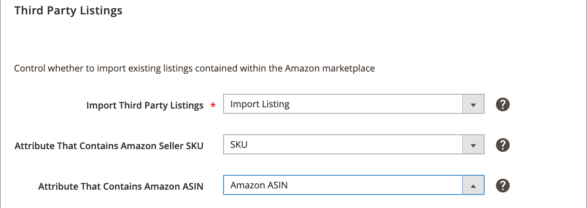

# 第三方列表

第三方列表设置是商店列表设置的一部分。 列表设置可从以下位置访问： [存储仪表板](./amazon-store-dashboard.md).

这些设置确定 [!DNL Commerce] 目录从您现有的导入产品 [!DNL Amazon Seller Central] 列表。 最佳实践是从Amazon导入列表，以确保所有列表都匹配 [!DNL Commerce] 产品。 当您的列表属于您的列表时 [!DNL Commerce] 从单个目录管理您的所有产品，并使用Amazon sales channel功能。 这些功能包括使用Amazon进行履行和订单管理、智能重新定价以及数量管理。

在配置为导入Amazon列表后，Amazon sales channel会将您的Amazon列表导入您的 [!DNL Commerce] 目录，尝试将它们与现有产品匹配。 如果未自动找到匹配项，您可以将Amazon列表作为新列表导入 [!DNL Commerce] 或手动将列表与产品匹配。

如果选择导入Amazon列表，请选择 [!DNL Commerce] 具有Amazon卖方SKU和Amazon ASIN值的属性。 如果您没有 [!DNL Commerce] [产品属性](./ob-creating-magento-attributes.md)，请考虑创建和分配它们。 映射这些属性有助于将导入的Amazon列表与您的 [!DNL Commerce] 产品。

初始列表导入会在以下情况下启动 [存储集成](./store-integration.md) 完成。 之后，根据您的电脑设置， [!DNL Commerce] 不断检查新添加的Amazon列表(未在AmazonSales Channel中创建)并更新您的 [!DNL Commerce] 根据您的第三方列表设置进行编目。

## 配置第三方列表设置

1. 单击 **[!UICONTROL Listing Settings]** 在商店仪表板上。

1. 展开 _[!UICONTROL Third Party Listings]_部分。

1. 对象 **[!UICONTROL Import Third Party Listings]** （必需），选择一个选项：

   - `Import Listing`  — （默认）选择您希望将Amazon列表中的产品信息导入到中的时间 [!DNL Commerce] 产品目录。 此选项是默认选项，建议使用。

   - `Do Not Import Listing`  — 选择手动操作的时机 [创建和分配新产品](https://docs.magento.com/user-guide/catalog/products.html){target="_blank"} 敬您的 [!DNL Commerce] Amazon列表的目录。
   >[!NOTE]
   >以下选项字段仅在设置为时处于活动状态 `Import Listing`.

1. 对象 **[!UICONTROL Attribute That Contains Amazon Seller SKU]**，选择 [!DNL Commerce] 与Amazon卖方SKU值匹配的属性。

1. 对象 **[!UICONTROL Attribute That Contains Amazon ASIN]**，选择 [!DNL Commerce] 您创建的属性，并将其与Amazon ASIN匹配。

   >[!NOTE]
   >如果您没有创建这些 [!DNL Commerce] Amazon列表的属性，请参阅 [为Amazon匹配创建属性](./ob-creating-magento-attributes.md).

1. 完成后，单击 **[!UICONTROL Save listing settings]**.

| 字段 | 描述 |
|---|---|
| [!UICONTROL Import Third Party Listings] | 必需。 选项：<ul><li>**[!UICONTROL Import Listing]**  — （默认）选择您希望将Amazon列表中的产品信息导入到中的时间 [!DNL Commerce] 产品目录。 </li><li>**[!UICONTROL Do Not Import Listing]**  — 选择手动操作的时机 [创建和分配新产品](https://docs.magento.com/user-guide/catalog/products.html){target="_blank"} 敬您的 [!DNL Commerce] Amazon列表的目录。</li></ul> |
| [!UICONTROL Attribute That Contains Amazon Seller SKU] | 仅在设置为时有效 `Import Listing`. 选择 [!DNL Commerce] 属性匹配于Amazon销售方SKU的Amazon属性。 如果此属性不存在，请参阅 [创建用于Amazon匹配的Amazon产品属性](./ob-creating-magento-attributes.md). 如有需要，请查看您的 [!DNL Commerce] [属性](./managing-attributes.md) 和创建或编辑属性以匹配此Amazon数据。 |
| [!UICONTROL Attribute That Contains Amazon ASIN] | 仅在设置为时有效 `Import Listing`. 选择 [!DNL Commerce] 与Amazon ASIN的Amazon属性匹配的属性。 如果此属性不存在，请参阅 [创建用于Amazon匹配的Amazon产品属性](./ob-creating-magento-attributes.md). 如有需要，请查看您的 [!DNL Commerce] [属性](./managing-attributes.md) 和创建或编辑属性以匹配此Amazon数据。 |

**快速访问** - [!UICONTROL Listing Settings] 区域

- [[!UICONTROL Product Listing Actions]](./product-listing-actions.md)
- [[!UICONTROL Third Party Listings]](./third-party-listing-settings.md)
- [[!UICONTROL Listing Price]](./listing-price.md)
- [[!UICONTROL (B2B) Business Price]](./business-pricing.md)
- [[!UICONTROL Stock / Quantity]](./stock-quantity.md)
- [[!UICONTROL Fulfilled By]](./fulfilled-by.md)
- [[!UICONTROL Catalog Search]](./catalog-search.md)
- [[!UICONTROL Product Listing Condition]](./product-listing-condition.md)
