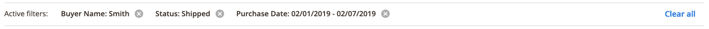
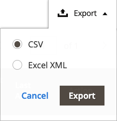

# 工作区控件

Amazon销售渠道[主页](./amazon-sales-channel-home.md)具有一些常见的工作区控件，包括“过滤器”、“默认视图”、“列”和“导出”。 并非所有页面都具有相同的控制选项。

## 操作

_[!UICONTROL Actions]_选择器提供了可供页面用户使用的操作列表。 选择后，该操作将应用于所有选定项目。 要对特定项目应用操作，请选中每个项目第一列中的复选框，然后在_[!UICONTROL Actions]_&#x200B;下选择一个选项。

例如，当选择器显示在&#x200B;_[!UICONTROL Attributes]_页面上时，它包括_[!UICONTROL Re-import Product Attribute Values]_&#x200B;操作。 选择此操作可对相应的[!DNL Amazon Seller Central]帐户执行ping操作，并刷新左侧列中选中的每个Amazon存储项的[!DNL Commerce]数据。

## 过滤器

_[!UICONTROL Filters]_控件显示用于缩小表中显示的数据的选项。 过滤器选项基于在“列”控件中选择的列。 过滤器选项仅针对列控件中启用的列显示。

过滤器控件可以包括用于缩小指定日期数据范围的动态日历、具有预定义选择的列的下拉菜单以及可能包含自定义数据的自由文本字段。

以下示例显示了用于筛选订单列表的设置，以便仅显示满足以下条件的订单：

- 下达2/01/2019至2/07/2019之间的订单，以及
- 采购员名为`Smith`的订单，以及
- 状态为`Shipped`的订单。

设置过滤选项后，单击&#x200B;**[!UICONTROL Apply Filters]**&#x200B;以过滤列出的数据。 单击取消可退出“过滤器”控件而不应用。

在对数据应用过滤器后，将显示&#x200B;**[!UICONTROL Active Filters]**&#x200B;信息。 您可以单击图标以清除特定过滤器选项，或单击&#x200B;**[!UICONTROL Clear All]**&#x200B;清除所有已应用的过滤器。

## 查看

“查看”控件基于页面的默认列，因此它被命名为“默认视图”。 您可以使用Columns控件添加或删除可用列。 自定义列时，您随后可以在“视图”控件中将视图另存为自定义视图。

在页面中添加或删除列时，将显示：

1. 单击&#x200B;**[!UICONTROL Default View]** > **[!UICONTROL Save View As...]**。

1. 输入视图名称。

1. 要保存自定义视图，请单击箭头图标。

在此示例中，_Order Id_&#x200B;列将添加到Column控件中，并另存为自定义视图。 请注意，在保存自定义视图名称后，视图的名称从&#x200B;_Default View_&#x200B;更改为输入的名称。

您可以在&#x200B;_[!UICONTROL View]_菜单中选择所需的视图，以在视图之间进行切换。

如果要删除或更改自定义视图的名称，请单击铅笔图标。 然后，您可以输入其他名称，也可以单击垃圾桶图标以删除自定义视图。 无法删除默认视图。

## 列

列控件允许您在页面显示中添加或删除数据列。 每个Amazon销售渠道页面都有一个预设的数据列组合，但大多数页面都有额外的可用列。 如果没有其他可用列，您仍可以从显示中删除默认列。

以下示例显示Columns控件。 选中的选项与页面上显示的列标题相对应。

- 要向页面添加数据列，请选中复选框。
- 要从页面中删除数据列，请勿选中复选框。

复选框更改将立即显示。 如果进行更改并退出页面，则页面会返回默认列显示。 对于您定期进行的更改，您可以在视图控件中将列更改另存为自定义视图。 然后，您可以在视图控件中进行切换，而无需手动添加或删除列。

您可以单击&#x200B;**[!UICONTROL Reset]**&#x200B;将选项设置回默认设置，也可以单击&#x200B;**[!UICONTROL Cancel]**&#x200B;退出而不进行更改。

## 导出

利用导出选项，可将数据导出到数据文件，而不能导入到第三方软件或单独的数据库。 导出的数据仅限于显示的数据。 如果需要，请确保在使用导出控件之前添加或删除列。

准备好导出数据时，选择导出格式选项，然后单击&#x200B;**[!UICONTROL Export]**。

- CSV — 包含纯文本数据的逗号分隔值文件
- Excel XML — 一种基于XML的电子表格数据格式（通常用于Excel用户）

生成的数据文件会自动保存到您指定的文件夹中下载。

