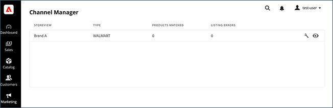

# 将销售渠道连接到 [!DNL Walmart Marketplace]

在上安装Channel Manager后 [!DNL Commerce] 例如，将商务商店连接到Walmart Marketplace。

1. [创建销售渠道](#create-the-sales-channel) ，方法是为产品清单选择商务商店。

1. [将渠道连接到 [!DNL Walmart Marketplace] 通过添加Walmart API凭据](#connect-the-channel-to-walmart-marketplace).

1. [完成销售渠道设置](#complete-store-setup) 管理您的Walmart Marketplace产品分类的列表、库存、定价和订单。

## 创建销售渠道

1. 在管理员中，打开 [!DNL Channel Manager] 选择 **[!UICONTROL Marketing** > _渠道&#x200B;_> **渠道管理器]**.

1. 在 **[!UICONTROL Marketplaces available to connect]** 选择 **[!UICONTROL Get Started]**.

   ![将新沃尔玛商店连接到 [!DNL Channel Manager]](assets/channel-manager-home.png)

1. 如果需要，请设置您的Walmart Marketplace销售商帐户。

1. 配置存储和连接：

   - 选择 **[!UICONTROL Add Credentials]**.

   - 选择 [!DNL Commerce] 存储视图以连接到商城。

      ![配置商务与 [!DNL Walmart Marketplace] 从 [!DNL Channel Manager]](assets/configure-commerce-to-marketplace-connection.png)

   - 输入唯一 **[!UICONTROL store name]**.

   - 选择 **[!UICONTROL Adobe Commerce site]** （对于产品列表）。

   - 添加 **[!UICONTROL email address]** 接收与 [!DNL Channel Manager].

1. 将渠道连接到 [!DNL Walmart Marketplace].

   - 添加的凭据 [[!DNL Walmart Marketplace Adobe Production API key]](walmart-prerequisites.md#generate-a-walmart-marketplace-production-api-key) 从 [!DNL Walmart Marketplace Seller] 帐户。

   - 如果您没有凭据，请从 [!DNL Walmart Marketplace Developer Portal] 选择 **[!UICONTROL Get API credentials]**.

      在开发人员门户上，选择您所在的地区（美国和加拿大），然后登录。

      ![[!DNL Walmart Marketplace] 帐户登录](assets/walmart-marketplace-login-page.png)

   - 在API密钥表单中，复制并保存 **[!UICONTROL Client ID]** 和 **[!UICONTROL Client Secret]** 值 [!UICONTROL Adobe Inc Production API key] 到安全位置。

      ![[!DNL Walmart Marketplace API key] 配置页面](assets/walmart-api-key-management-form.png)

      >[!NOTE]
      >
      >如果 [!DNL Adobe Inc] 键未在开发人员门户中列出，请选择 **[!UICONTROL Add New Key for a Solution Provider]** 以配置权限并生成密钥。 有关配置详细信息，请参阅 [生成 [!DNL Walmart Marketplace API Key]](walmart-prerequisites.md#generate-a-walmart-marketplace-api-key).

   - 返回 [!DNL Channel Manager] 将凭据添加到 **[!UICONTROL Walmart Connection]** 信息。

      添加凭据时，Adobe会隐藏客户端密钥并将值存储在安全电子仓库中。

1. 选择 **[!UICONTROL Save Store]** 应用配置并连接到 [!DNL Walmart marketplace].

1. 成功连接后， [完整商店设置](complete-store-setup.md) 从 **[!UICONTROL Channel Manager]** 存储页面。

### 连接问题疑难解答

如果与沃尔玛的连接失败，请查看 [Walmart Marketplace常见问题解答](https://developer.walmart.com/faq/us/faq-auth/){target=&quot;_blank&quot;}以了解疑难解答提示。

- 从 [!DNL Walmart Developer Portal]，确认您复制了 [!UICONTROL Adobe Inc.]

- 验证WalmartAdobeAPI密钥的访问配置是否具有正确的权限。 请参阅 [沃尔玛先决条件](walmart-prerequisites.md##generate-a-walmart-marketplace-api-key).

- 确认 [!DNL Walmart API] 服务可从 [Walmart API状态页面](https://developer.walmart.com/us/whats-new/new-api-status-information-now-available/){target=&quot;_blank&quot;}。
