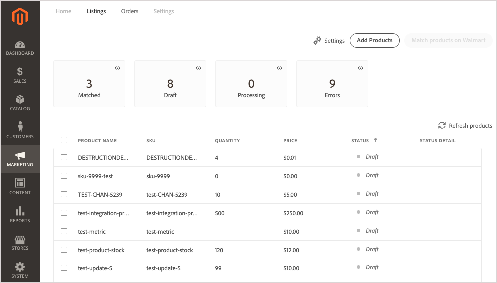

# 管理列表

管理的产品清单 [!DNL Walmart Marketplace] 销售渠道 [!UICONTROL Listings] 在渠道存储视图中。 单个列表的状态指示产品在 [!DNL Channel Manager] 工作流，以便您确定后续步骤并解决任何错误。

单个列表的状态指示产品在 [!DNL Channel Manager] 工作流，以便您确定后续步骤并解决任何错误。

您可以从列表视图完成以下任务。

* 查看当前列表
* 排序和过滤列表
* 添加产品
* 匹配产品
* 跟踪列表状态

## 查看产品列表

1. 从管理员中，转到 [!UICONTROL **营销** >渠道> **渠道管理器**].

1. 从“渠道商店”列表中，在商店登入行中选择铅笔图标以打开商店视图。

1. 选择 [!UICONTROL **列表**].

1. 排序 *列表* 查看方式：选择 *列表* 表。

1. 筛选 *列表* 查看，方法是选择一个状态计数卡。

1. 通过选择 **刷新产品**.

## 将商务产品添加到渠道管理器

为 [!DNL Walmart Marketplace] 渠道（完成以下任务）：

* [从 [!DNL Commerce] 产品目录到 [!DNL Channel Manager]](add-products-to-channel-store.md)

* [映射目录属性](map-catalog-attributes.md#configure-product-attribute-settings)

## 将产品发布到 [!DNL Walmart]

您可以在 [!DNL Walmart Marketplace] 使用产品匹配或手动上传新产品的产品清单。

* **[在沃尔玛匹配产品](publish-listings-to-marketplace.md)** — 将产品清单从渠道发布到 [!DNL Walmart Marketplace] 通过更新销售同一产品的现有列表。 匹配条件由 [属性映射配置](map-catalog-attributes.md) 频道。

* **[手动上传新列表](publish-listings-to-marketplace.md#upload-new-product-listings)** — 对于与上的现有列表不匹配的产品 [!DNL Walmart Marketplace]，使用 [!DNL Walmart] 产品类别Excel模板，以批量上传产品列表。

## 列出控件和列描述

下表介绍了可用的控件和列 [!UICONTROL Listings].

**控件[!UICONTROL Listings]**

| **控制** | **描述** |
|----------------------------------------|--------------------------------------------------------------------------------------------------------------------------------------------------------------------------------------------------------------|
| [!UICONTROL Add Products] | 打开 [!UICONTROL Admin Product Catalog] 页面选择要添加到 [!DNL Walmart Marketplace] 分类，或更新产品属性以满足Walmart Marketplace的列表要求。 |
| [!UICONTROL Match products on Walmart] | 在选择一个或多个处于“草稿”状态的产品后，选择“匹配” [!DNL Walmart] 来检查是否可以添加到现有 [!DNL Walmart Marketplace] 列表。 |
| [!UICONTROL Refresh products] | 使用最新列表和状态更新显示内容。 此控件还会将列表视图重置为默认排序顺序，并删除任何过滤器。 |
| [!UICONTROL Filter by *状态*] | 通过选择列表表上方的状态计数卡之一，只显示具有特定状态的列表。 使用 *刷新产品* 来删除过滤器。 |
| [!UICONTROL Sort products] | 通过选择任何列标题更改列表的排序顺序。 |

**列描述**

| **字段** | **描述** |
|------------------------------|-----------------------------------------------------------------------------------------------------------------------------------------------------------------------------------------------------------------------------------------------------------------------------------------------------------------------------------------------------------------------------------------------------------------------|
| [!UICONTROL Product name] | 从 [!DNL Commerce] 存储目录。 |
| [!UICONTROL SKU (Unique ID)] | 用于匹配市场上产品的映射属性。 此字段名称会因为 [!DNL Channel Manager] 列表。 在这种情况下，产品匹配操作将使用 [!DNL Commerce] 目录 [!DNL Walmart Marketplace]  列出的SKU值与 [!DNL Commerce] 产品属性。 |
| [!UICONTROL  Quantity] | Adobe Commerce或Magento Open Source中可用的库存量。 |
| [!UICONTROL Price] | 产品价格 [!DNL Commerce] 存储目录。 目录价格更新将同步到渠道管理器，然后发送到 [!DNL Walmart Marketplace]  让所列项目显示当前价格。 |
| [!UICONTROL Status] | 指示 [!DNL Commerce] 订单工作流。 成功将产品添加到 [!DNL Channel Manager] 以及当您匹配市场上的产品时。 如果操作失败，则列表会显示错误状态。 修正错误后， [!DNL Channel Manager] 重试操作并更新状态。 |
| [!UICONTROL Status Detail] | 提供有关 *错误* 或 *匹配* 状态。 |

### 关于列表状态

在列表工作区中，状态标签显示产品在 [!DNL Channel Manager] 工作流，以便您确定后续步骤并解决错误。 列表可以具有以下状态标签：

* **[!UICONTROL Draft]** — 标识尚未 [已提交 [!DNL Walmart] 匹配](publish-listings-to-marketplace.md#match-products).

* **[!UICONTROL Processing]** — 标识为在 [!DNL Walmart Marketplace]. 产品仍保留在 *处理* 状态，直到 [!DNL Walmart] 返回指示匹配是否成功或是否出错的HTTP状态消息。 在 [!DNL Walmart Marketplace].

* **[!UICONTROL Match]** — 标识成功匹配的产品 [!DNL Walmart].

   当产品属性值（例如UPC代码）与现有[!DNL Walmart Marketplace] 列表。 当产品匹配时，会将商务产品选件添加到现有 [!DNL Walmart] 列表。

   检查 [[!UICONTROL Walmart Marketplace Seller Account Items]](https://seller.walmart.com/items-and-inventory/manage-items) 功能板，以审核更新的产品列表并验证产品详细信息、价格和库存数量。

* **[!UICONTROL Match - Match in Stage]** — 标识与 [!DNL Walmart] 在 [!DNL Walmart Marketplace] 存储处于实时状态。 当 [!DNL Walmart Marketplace] 商店上线。

* **[!UICONTROL Error]** — 标识与现有产品不匹配的产品 [!DNL Walmart Marketplace] 列表。

* **[!UICONTROL Error description]** — 提供有关列表错误的详细信息。

   解决错误后，请重新提交产品以进行匹配。 请参阅 [产品匹配错误疑难解答](publish-listings-to-marketplace.md#troubleshoot-product-match-errors).
