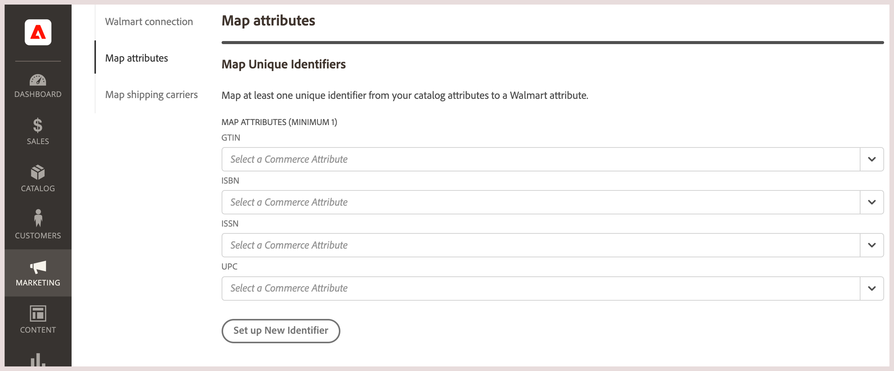

# 映射目录属性

在从 [!DNL Commerce] to [!DNL Walmart Marketplace]，则必须从 [!DNL Commerce] Walmart中相应标识符的目录。

需要此步骤才能匹配 [!DNL Commerce] 现有产品 [!DNL Walmart] 列表和同步产品数据 [!DNL Commerce] 和 [!DNL Walmart]. 的 [!DNL Commerce] 产品必须至少具有一个与 [!DNL Walmart].

**必需 [!DNL Walmart] 产品ID**

| **接受类型** | **名称** | **用途** | **可接受位数** |
|-------------------|--------------------------------------|--------------------------------------------------------------------------------------------------------------------------------------------------|-----------------------|
| GTIN | 全球贸易项目 | 通用用途，在全球范围内使用 | 14位 |
| ISBN | 国际标准书号 | 平装书、精装书和电子书 | 10位或13位 |
| ISSN | 国际标准序列号 | 8位序列号，用于识别所有媒体印刷和电子印刷的各类杂志、期刊、报纸和期刊 | 8位 |
| UPC | 通用产品代码 | 标准零售跟踪代码 | 12位 |

如果您的目录没有匹配的属性， [添加或转换现有目录属性](https://docs.magento.com/user-guide/catalog/product-attributes.html).

## 映射唯一标识符

1. 从 **[!UICONTROL Listings]** 或 **[!UICONTROL Orders]** 页面，选择 **[!UICONTROL Channel Settings]**.

1. 开 **[!UICONTROL Channel Settings]**，选择 **[!UICONTROL Map Attributes]**.

   - 查找 [!DNL Walmart Marketplace] 属性。

   - 从 [!DNL Commerce] 存储目录。

      以下示例映射 [!UICONTROL Walmart Marketplace UPC] 属性。

      

   - 选择 **[!UICONTROL Save]**.

