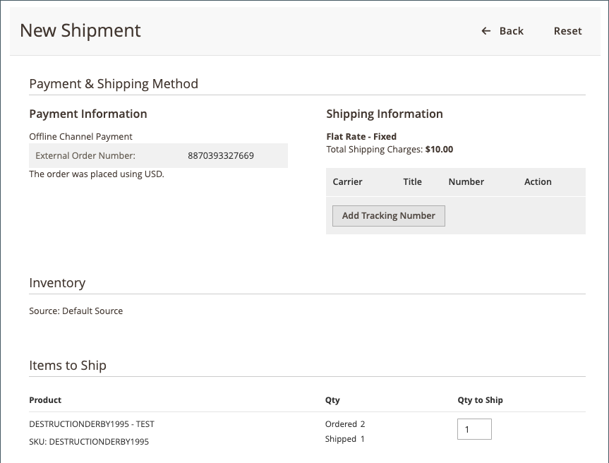

# 处理订单

在确认[!DNL Walmart Marketplace]订单并成功发送到[!DNL Channel Manager]后，您使用[Commerce Order Management](https://experienceleague.adobe.com/docs/commerce-admin/stores-sales/order-management/orders/orders.html#orders-workspace)处理该订单。

渠道管理器将更新同步到[!DNL Walmart Marketplace]，以确保来自[!DNL Commerce]的订单状态和送货信息与[!DNL Walmart Marketplace]中跟踪的数据匹配。

* **订单发货** — 沃尔玛要求所有发货都有跟踪编号。 如果某些物料缺货，您可以创建部分发运以发送当前可用的物料。 在您提交装运后，订单更新将同步到[!DNL Walmart Marketplace]。 然后，沃尔玛会通知客户订单状态和发货详情。

* **订单取消** — 当您取消[!DNL Walmart Marketplace]订单时，沃尔玛要求取消原因，该原因包含在发送给客户的订单取消通知中。 取消原因也显示在[!DNL Commerce]订单付款信息中。 在您提交取消后，库存更新将同步到[!DNL Walmart Marketplace]。 然后，沃尔玛会通知客户订单状态和发货详情。

  在店面，您必须取消整个订单。 [!DNL Commerce]不允许部分取消。

* **退款请求** — 如果为已发运的订单请求沃尔玛商城退货，则[!UICONTROL Status details]将包含退货的链接。 从[退货](return-refund-orders.md)仪表板管理退货和退款。

当处理Commerce订单且[!DNL Channel Manager]成功将装运、部分装运和取消更新同步到[!DNL Walmart Marketplace]时，订单处理完成。 从[退货](return-refund-orders.md)仪表板管理已装运订单的退货请求和退款。

>[!NOTE]
>
> 将订单更新同步到[!DNL Walmart Marketplace]最多可能需要五分钟。 要检查订单状态，请返回[!DNL Channel Manager]订单页面。

## 发送订单

1. 从管理员中，选择&#x200B;**[!UICONTROL Marketing]** > **[!UICONTROL Channel Manager]**。

1. 通过选择销售渠道商店的眼睛图标来打开商店视图。

1. 要查看[!DNL Walmart Marketplace]订单，请选择&#x200B;**[!UICONTROL Orders]**。

1. 在“订单”表中，通过选择&#x200B;**[!UICONTROL Commerce Order Number]**&#x200B;打开要发运的订单。

1. 通过选择&#x200B;**[!UICONTROL Ship]**，为全部或部分订单创建并提交装运。

   [!DNL Walmart Marketplace]订单的{width="600" zoomable="yes"}

   * 选择装运承运人，并通过选择&#x200B;**[!UICONTROL Add tracking number]**&#x200B;添加跟踪编号。

     [!DNL Walmart Marketplace]订单的{width="600" zoomable="yes"}

   * 根据需要完成其余的送货表格。 有关详细说明，请参阅[[!DNL Shipping an Order]](https://experienceleague.adobe.com/docs/commerce-admin/stores-sales/order-management/orders/order-ship.html)。

1. 提交装运后，在[!DNL Channel Manager]中跟踪[订单状态](manage-orders.md#about-order-status)以验证更新是否已发送到[!DNL Walmart Marketplace]。

在订单发运后，您可以根据从[!DNL Walmart Marketplace]收到的退货请求，处理订单中包含的物料从[!DNL Channel Manager]中全部或部分退款。 请参阅[退货和退款订单](return-refund-orders.md)。

## 取消订单

1. 从管理员中，选择&#x200B;**[!UICONTROL Marketing]** > **[!UICONTROL Channel Manager]**。

1. 通过选择销售渠道商店的眼睛图标来打开商店视图。

1. 要查看[!DNL Walmart Marketplace]订单，请选择*[!UICONTROL Orders]**。

1. 在“订单”表中，选择要取消的订单的&#x200B;**[!UICONTROL Commerce Order Number]**&#x200B;以打开[订单详细信息页面](manage-orders.md#view-order-detail)。

   [!DNL Walmart Marketplace]订单的{width="600" zoomable="yes"}

1. 取消订单。

   * 从“订单详细信息”菜单中选择&#x200B;**取消**。

   * 在[!UICONTROL Cancel Order]窗体上，选择&#x200B;**[!UICONTROL Cancellation reason]**。

   [!DNL Walmart Marketplace]订单的{width="600" zoomable="yes"}

   * 选择&#x200B;**[!UICONTROL Cancel Order]**。

1. 提交取消后，在[!DNL Channel Manager]中跟踪[订单状态](manage-orders.md#about-order-status)以验证更新是否已发送到[!DNL Walmart Marketplace]。

## 修复订单错误

在从[!DNL Walmart Marketplace]开始的订单同步过程中，或在发运、部分发运和取消的订单更新过程中，可能会出错。

如果对装运、部分装运或取消更新的同步操作失败，[!DNL Channel Manager]订单页将显示订单的&#x200B;_错误_&#x200B;状态。 为确保装运信息和订单取消信息准确反映在沃尔玛商城帐户中，请手动更新[!DNL Walmart Marketplace]商店中的订单。

